# 우크라이나 재건 - 21세기 최악의 사기극

*자료 기준 2026년 10월 9일. '사기극'과 '도둑놈 심보'는 재건 담론과 조달 방식에 대한 필자의 평가다. 본문의 형사사건은 모두 재판 중이거나 혐의 단계다.*

---

## 1. 역대 최대의 재건 시장이 열린다고 떠들었다

**우크라이나는 재건을 먼저 '시장'으로 팔았다. 그것도 아주 큰 소리로.**

2022년 7월 4일, 스위스 루가노. 개전 넉 달 만에 우크라이나 정부는 국가 회복계획을 들고 나왔다. 2032년까지 7,500억 달러 이상을 쓰고, 사업은 850여 개, 목표는 연평균 7% 이상의 성장이었다.[[62]](https://cdn.prod.website-files.com/621f88db25fbf24758792dd8/62c166751fcf41105380a733_NRC%20Ukraine%27s%20Recovery%20Plan%20blueprint_ENG.pdf)[[63]](https://ukraineinvest.gov.ua/en/news/15-07-22-2/)

우크라이나는 같은 무렵 각국에 피해 지역을 하나씩 맡기는 '후원 지도'까지 내밀었다. 어느 나라가 어느 지역을 책임질지를 돈 받을 쪽이 정해 준 셈이다. 이 구상은 덴마크-미콜라이우 한 쌍만 남기고 흐지부지됐다.[[50]](https://www.kyivpost.com/post/29917)

루가노 회의가 끝난 다음 날인 7월 6일, 서울에서는 우크라이나 의원들이 국토교통부 장관을 찾아와 마리우폴 재건을 맡아 달라고 했다. 국토부는 보도자료에 "7,500억불 규모의 전후 우크라이나 재건사업"에 우리 기업의 참여가 늘 것이라고 적었다. 그때 마리우폴은 이미 러시아 손에 있었다.[[12]](https://www.molit.go.kr/USR/NEWS/m_72/dtl.jsp?id=95086933)[[59]](https://www.etnews.com/20220706000197)[[13]](https://triblive.com/news/world/russia-claims-to-have-taken-full-control-of-mariupol)

2023년 5월에는 우크라이나 경제장관 스비리덴코가 서울에서 한국으로부터 "최대 80억 달러"의 초저리 차관을 끌어오게 됐다고 발표했다. 40년 만기에 연 0.15%라는 조건이었다.[[109]](https://ukrinform.net/rubric-economy/3710300-ukraine-to-attract-up-to-8b-from-korea-on-preferential-terms.html) 그런데 한국이 실제로 맺은 기본약정 한도는 21억 달러이고, 실제로 서명된 개별 차관은 1억 달러다.[[18]](https://www.kmu.gov.ua/en/news/ukraina-otrymaie-mozhlyvist-zaluchaty-kredytni-resursy-zahalnym-obsiahom-do-21-mlrd-vid-pivdennoi-korei-uriady-krain-pidpysaly-vidpovidnu-uhodu)[[19]](https://www.kmu.gov.ua/en/news/ukraina-vpershe-otrymaie-pilhove-finansuvannia-vid-respubliky-koreia-serhii-marchenko-pidpysav-kredytnyi-dohovir-na-100-mln-dolariv-ssha)

청구서는 해마다 커졌다. 세계은행 평가의 10년 재건 필요액은 2022년 3,490억 달러에서 2026년 5,877억 달러로 늘었다.[[2]](https://documents1.worldbank.org/curated/en/099022026094036395/pdf/P514499-22f93f3a-4278-42bc-b907-db9553d12069.pdf) 2026년 1월에는 '번영계획(Prosperity Plan)'이라는 이름으로 8,000억 달러가 등장했다. 전쟁 전 우크라이나 GDP의 약 네 배다.[[3]](https://me.gov.ua/News/Detail/a39127c6-0df8-4880-b795-74150fd0c278?isSpecial=true&lang=uk-UA&title=UkraineProsperityPlan)[[48]](https://kyivindependent.com/what-we-know-about-ukraines-800-billion-economic-peace-plan/)

재건회의도 매번 숫자 잔치였다. 2026년 6월 그단스크 재건회의에서 스비리덴코 총리는 "160건, 100억 유로 이상의 합의"를 성과로 내세웠다. 그 안에는 EU가 이미 다른 자리에서 결정한 대출의 첫 회차 32억 유로와 세계은행과의 34억 달러 협정이 들어 있었다.[[110]](https://euperspectives.eu/2026/06/gdansk-conference-brings-e10bn-to-impoverished-kyiv/)

메시지는 처음부터 일관됐다. 역사상 최대의 재건 시장이 열리니 끼고 싶으면 줄을 서라. **돈을 받을 쪽이 오히려 참여 기회를 나눠 주는 쪽처럼 굴었다.**

### 숫자는 컸고, 돈은 엉뚱한 데서 먼저 벌렸다

**막상 돈을 따라가 보면, 가장 먼저 돈이 된 것은 콘크리트가 아니라 기대였다.**

2023년 여름, 삼부토건 주가는 두 달 만에 다섯 배 가까이 뛰었다. 이유는 우크라이나 재건 기대였다.

그로부터 3년 뒤 이 회사의 2026년 반기보고서를 보면 해외사업 매출은 0원이다. 2024년에도, 2025년에도 0원이었다. 그사이 수사기관은 관련자들이 재건 테마로 주가를 띄운 뒤 주식을 팔아 369억원의 부당이득을 챙겼다며 기소했다.[[65]](https://dart.fss.or.kr/report/viewer.do?rcpNo=20260814004299&dcmNo=11540645&eleId=13&offset=164355&length=24051&dtd=dart4.xsd)[[67]](https://mobile.newsis.com/view_amp.html?ar_id=NISX20250926_0003345388)

우크라이나에서 공사를 한 건도 하지 않고도 돈을 번 사람이 있을 수 있다는 뜻이다. 재건은 아직 오지 않았는데 재건에 대한 기대는 이미 팔렸다.

재건을 둘러싼 돈은 다섯 종류다.

1. 우크라이나가 **필요하다고 계산한** 돈
2. 외국이 **약속한** 돈
3. 기업이 **수주한** 돈
4. 실제로 **지급된** 돈
5. 투자자가 **회수한** 돈

다섯 가지 돈은 크기도, 시점도, 주인도 다르다. 떠벌린 숫자는 대부분 1번과 2번이다. 실제로 오간 돈은 4번과 5번인데, 세계은행 집계로 2022~2025년 실제로 채워진 재건 필요액은 203억 달러, 10년 필요액의 3.5%에 불과하다.[[2]](https://documents1.worldbank.org/curated/en/099022026094036395/pdf/P514499-22f93f3a-4278-42bc-b907-db9553d12069.pdf) **그런데 재건 담론은 이 다섯을 이어 붙여 하나의 거대한 시장처럼 판다. 내가 이것을 사기극이라고 부르는 이유다.**

이 글이 따지려는 것은 전쟁 피해를 도울지 말지가 아니다. 비판의 대상은 셋이다.

- 외국 돈으로 나라를 새로 만들려는 우크라이나 정부의 계획
- 그 계획을 수주 기회로 포장한 각국 정부와 기업
- 기대를 주가와 금융상품으로 바꾼 시장

---

## 2. 전쟁 전부터 우크라이나는 낡아 있었다

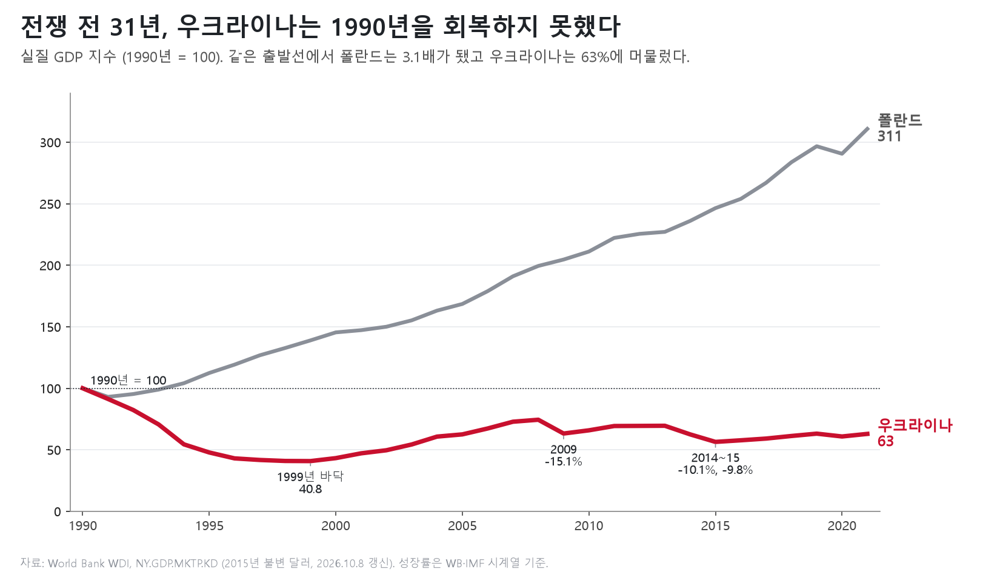

**침공이 엄청난 피해를 준 것은 맞다. 그러나 침공 전의 우크라이나가 멀쩡했던 것은 아니다.**

1990년의 실질 GDP를 100으로 놓으면 2021년 우크라이나는 62.9다. 전면 침공 직전까지 31년 동안 독립 당시의 경제 규모를 끝내 회복하지 못했다. 같은 기간 이웃 나라들의 성적은 이렇다.[[5]](https://api.worldbank.org/v2/country/UKR;POL;CZE;SVK;ROU;MDA;EST;LVA;LTU/indicator/NY.GDP.MKTP.KD?format=json&date=1990:2021&per_page=20000)

| 국가 | 2021년 실질 GDP (1990=100) |
|---|---:|
| 폴란드 | 310.8 |
| 슬로바키아 | 224.9 |
| 에스토니아 | 195.9 |
| 루마니아 | 189.6 |
| 체코 | 174.1 |
| 리투아니아 | 169.3 |
| 라트비아 | 149.2 |
| 몰도바 | 86.0 |
| **우크라이나** | **62.9** |

유럽의 가난한 나라로 꼽히는 몰도바보다도 뒤처졌다. 2021년 우크라이나의 1인당 GDP는 4,776달러였다. 건물·기계·기반시설에 쓴 투자(총고정자본형성)는 GDP의 13.2%에 그쳤다.[[5]](https://api.worldbank.org/v2/country/UKR;POL;CZE;SVK;ROU;MDA;EST;LVA;LTU/indicator/NY.GDP.MKTP.KD?format=json&date=1990:2021&per_page=20000) 투자하지 않는 나라의 시설은 낡을 수밖에 없다.

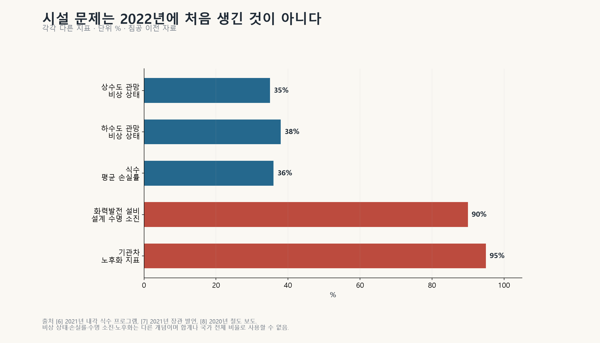

다음은 전쟁 전에 우크라이나 정부가 스스로 남긴 기록이다.

- 상수도관의 35%, 하수도관의 38%가 '비상 상태'였다. 수돗물은 36%가 공급 도중에 샜고, 펌프의 30%가 교체 대상이었다. 2021년 내각 문서에 적힌 내용이다.[[6]](https://zakon.rada.gov.ua/laws/show/388-2021-р)
- 화력발전 설비의 90%가 설계 수명을 다했다. 2021년 에너지부 장관의 말이다.[[7]](https://zn.ua/ECONOMICS/v-ukraine-90-enerhoblokov-tes-otrabotali-svoj-resurs-halushchenko.html)
- 기관차의 노후화 수준은 95%였다. 2020년 자료다.[[8]](https://gmk.center/?p=32065)

세계은행도 2021년에 이미 진단을 내놨다. 전쟁 탓을 할 수 없던 시점이다. 낮은 투자와 낮은 생산성, 그리고 소수의 기득권이 국가를 장악한 '국가 포획'이 문제로 꼽혔다.[[4]](https://www.worldbank.org/en/brief/2021/09/06/scd-consultations)

**침공 전의 문제는 미뤄 둔 투자와 유지보수였다. 침공 후에는 그 비용이 통째로 '재건 필요액'이라는 이름에 들어갔다.** 전쟁이 부순 것을 고치는 일과, 30년 동안 하지 못한 국가개발을 남의 돈으로 하는 일이 하나의 명분을 함께 쓰게 된 것이다.

새 관이 옛 관보다 나은 것은 사실이다. 그러나 질문이 두 개 남는다. 추가 비용은 누가 내는가. 그리고 설비를 유지하지 못한 구조가 그대로인데 건설비만 외부에서 받는다면 어떻게 되는가. 그때 외국은 한 번 돕고 끝나지 않는다. 그 시설이 돌아가는 내내 보조금을 대야 한다.

---

## 3. 루가노의 7,500억 달러는 복구 견적이 아니라 개발계획이었다

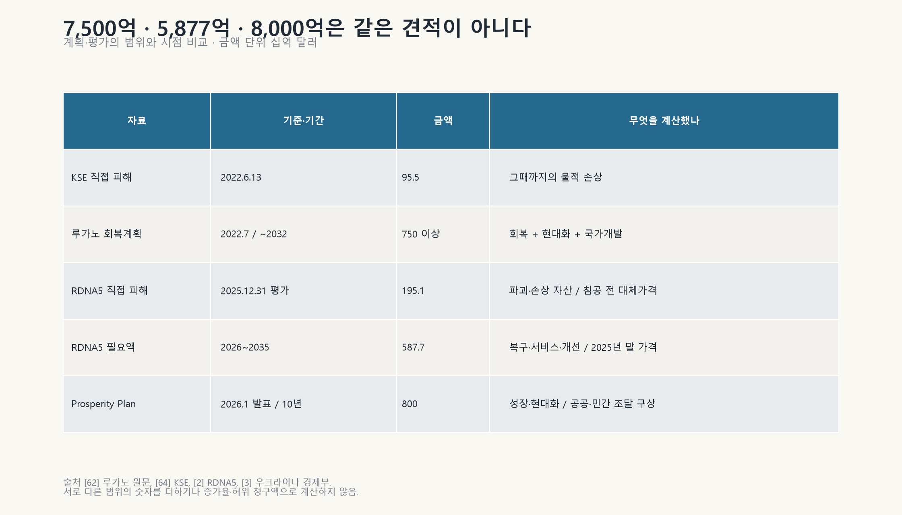

**맨 앞에서 본 루가노의 7,500억 달러, 그 원문을 열어 보면 성격이 분명하다.**

계획서 2쪽에서 우크라이나 정부는 이 계획을 이렇게 소개했다. 전쟁 피해를 복구하는 데 그치지 않고 경제 성장과 삶의 질을 단숨에 '도약(leap-frog)'시킬 특별한 기회라고. 같은 쪽에는 지난 20년간 우크라이나의 성장률이 연 2%도 안 돼 폴란드(약 3.5%)에 뒤처졌다는 고백도 있다.[[62]](https://cdn.prod.website-files.com/621f88db25fbf24758792dd8/62c166751fcf41105380a733_NRC%20Ukraine%27s%20Recovery%20Plan%20blueprint_ENG.pdf)

12쪽에는 결정적인 숫자가 있다. **우크라이나 정부가 스스로 추정한 '파손 자산 복구 비용'은 약 1,650억 달러였다.**[[62]](https://cdn.prod.website-files.com/621f88db25fbf24758792dd8/62c166751fcf41105380a733_NRC%20Ukraine%27s%20Recovery%20Plan%20blueprint_ENG.pdf) 7,500억 달러 가운데 부서진 것을 고치는 돈은 5분의 1 남짓이라는 뜻이다. 그렇다면 나머지 약 6,000억 달러는 어디에 쓰겠다는 것인가. 15개 '국가 프로그램'의 사업 목록을 펼쳐 보면 답이 나온다.

### 7,500억 달러 장바구니에 담긴 것들

| 국가 프로그램 | 요구액 | 장바구니에 담긴 사업 |
|---|---|---|
| 주택·지역 현대화 | 1,500억~2,500억 달러 | 건물 에너지효율 개선 약 600억, 기존 주택 대수선 약 450억, 상하수도 현대화 약 420억(관망을 새로 까는 110억 포함), 난방 현대화 약 260억(가정용 히트펌프 180억 포함), 새 주택·임시주택·파손 주택 재건을 합쳐 약 410억, 탄광도시 경제 다각화 17억 |
| 에너지 독립·그린딜 | 약 1,280억 달러 | 수소 생산용 재생에너지 30GW 이상 380억, 가스 증산 약 180억, 재생에너지·양수발전 150억, 원전 신규 2GW 등 약 140억, 수전해 설비 15GW 약 70억, 수소 운송망 20억, 스마트그리드 50억~100억 |
| 물류·EU 연결 | 1,160억 달러 이상 | 키이우–바르샤바 고속철도, 도로 2만7,200km·교량 3,000개 신설·현대화, 전기차 충전소, 화차·기관차 교체. 철도 장기투자 300억~400억 달러는 아직 넣지도 않았다 |
| 금융 접근성 | 약 650억 달러 | 은행 자본 확충 150억~200억, 대출·주택담보 지원, 투자용 전쟁보험 |
| 거시재정 안정 | 600억~800억 달러 | 정부 예산의 재원 확보 |
| 고부가가치 산업 | 약 500억 달러 | 농식품 가공 102억, 육류·우유 증산 55억, 100만ha 관개시설 40억, 수소환원·전기로 '녹색 철강', 자동차 부품 클러스터 30억, IT 스타트업 지원 |
| 사회 인프라 | 300억~350억 달러 | 고효율·접근성 기준에 맞춘 사회시설 현대화 약 290억, 사립학교 25곳·애국교육센터 25곳·과학관 35곳, 산업단지 60곳 기반시설 |

*출처: 우크라이나 국가회복위원회, Ukraine's Recovery Plan blueprint (2022.7) 10~12·17·20~24·34~36쪽.[[62]](https://cdn.prod.website-files.com/621f88db25fbf24758792dd8/62c166751fcf41105380a733_NRC%20Ukraine%27s%20Recovery%20Plan%20blueprint_ENG.pdf) 요구액은 프로그램별 추정치다. 일부는 서로 겹치고, 국방·안보 비용은 빠져 있다.*

이 목록에서 '전쟁 피해 복구'라는 이름이 붙은 줄을 찾아보면 이렇다.

- **에너지:** 크레멘추크·체르니히우·오흐티르카의 파손된 열병합발전소 복구는 **6억 달러**다. 같은 프로그램의 수소 관련 사업(재생에너지 380억 + 수전해 70억 + 운송망 20억)은 **470억 달러**다.
- **사회 인프라:** 필수 사회시설의 파손 복구는 **약 6억 달러**, 경미한 파손 시설 보존은 **약 24억 달러**다. 같은 프로그램의 '고효율·접근성 기준 현대화'는 **약 290억 달러**다.
- **주택:** 파손 주택 재건은 새 주택·임시주택과 한 줄로 묶여 약 410억 달러다. 반면 전쟁과 상관없는 기존 주택 대수선과 에너지효율 개선만 **1,050억 달러**다.

교통에 대해서는 계획서가 직접 털어놨다. 교통 인프라는 과거에 심각하게 과소투자됐고, 기관차의 94%가 25년이 넘었으며, 본격적인 도로 재건은 2018년에야 시작됐다고. 전쟁 피해는 "그 위에" 더해졌다고.[[62]](https://cdn.prod.website-files.com/621f88db25fbf24758792dd8/62c166751fcf41105380a733_NRC%20Ukraine%27s%20Recovery%20Plan%20blueprint_ENG.pdf)

**부서진 것을 고치는 데 1,650억 달러, 장바구니에는 7,500억 달러. 나머지는 수소 공장, 고속철도, 히트펌프, 녹색 철강, 은행 자본, 그리고 정부 예산이다. 소련 시절로 돌아가자는 복구 계획이 아니다. 남의 돈으로 유럽 수준까지 한 번에 올라가겠다는 국가개발 계획이다.**

돈은 누가 내는가. 계획은 전체 자금의 약 3분의 2를 '파트너'가 대야 한다고 적었다. 그 구성은 다음과 같다.[[62]](https://cdn.prod.website-files.com/621f88db25fbf24758792dd8/62c166751fcf41105380a733_NRC%20Ukraine%27s%20Recovery%20Plan%20blueprint_ENG.pdf)

- 파트너의 대출·지분 투자: 2,000억~3,000억 달러
- 파트너의 보조금: 2,500억~3,000억 달러
- 민간 자금: 2,500억 달러 이상

같은 시기 KSE가 집계한 직접 물적 피해는 955억 달러였다.[[64]](https://kse.ua/russia-will-pay/) 핵심은 이것이다. **이 구상은 처음부터 부서진 것을 고치는 범위를 훌쩍 넘어섰고, 그 돈의 대부분을 외부에 요구했다.**

나는 이런 조달 방식을 도둑놈 심보라고 본다. 우크라이나 국민을 두고 하는 말이 아니다. 자국의 오랜 개발 과제를 전쟁 피해의 명분에 얹어 외국 재정과 민간 자금으로 해결하려는 정부의 방식을 두고 하는 말이다. **돈을 요청할 권리가 있다고 해서 상대방에게 낼 의무가 생기지는 않는다.**

2026년의 8,000억 달러짜리 계획은 이름부터 '재건'이 아니라 '번영'이다.[[3]](https://me.gov.ua/News/Detail/a39127c6-0df8-4880-b795-74150fd0c278?isSpecial=true&lang=uk-UA&title=UkraineProsperityPlan)

7,500억, 5,877억, 8,000억. 세 숫자는 범위도 기간도 다르다. 그래도 공통점이 하나 있다. **어느 것도 기업에 지급될 수주 잔고가 아니다.**

---

## 4. 5,877억 달러 안에는 건설 시장이 아닌 것이 너무 많다

**세계은행이 2026년 2월 발표한 우크라이나 피해·수요 평가 보고서(RDNA5)의 숫자는 세 개다.**[[1]](https://www.worldbank.org/en/news/press-release/2026/02/23/updated-ukraine-recovery-and-reconstruction-needs-assessment-released)[[2]](https://documents1.worldbank.org/curated/en/099022026094036395/pdf/P514499-22f93f3a-4278-42bc-b907-db9553d12069.pdf)

- 직접 피해: 1,951억 달러 (2025년 말까지 부서진 자산)
- 경제·서비스 손실: 6,667억 달러
- 향후 10년 복구·재건 필요액: 5,877억 달러

피해액은 침공 직전 가격으로 계산한, 실제로 부서진 자산이다. 필요액은 2025년 말 가격을 기준으로 하고, 거기에 더 높아진 기준과 현대화, 물가 상승을 얹은 앞으로의 지출이다. **부서진 것은 1,951억 달러어치인데, 앞으로 쓰겠다는 돈은 그 세 배다.**

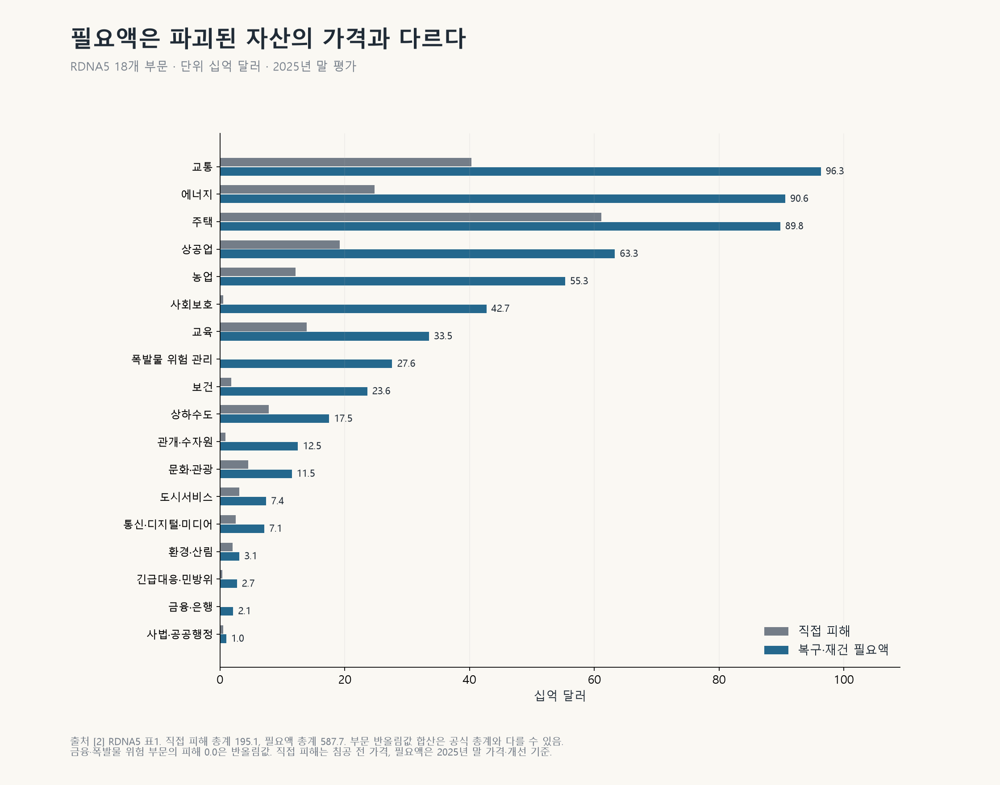

| 부문 | 피해 | 필요액 | 이 돈의 성격 |
|---|---:|---:|---|
| 교통 | 40.3 | 96.3 | 통행료·운임으로 회수될지는 별개 문제 |
| 에너지 | 24.8 | 90.6 | 발전·송배전 체계 전환. 요금이 받쳐 줘야 함 |
| 주택 | 61.1 | 89.8 | 단열·기준 개선. 주민의 구매력과 귀환이 관건 |
| 상공업 | 19.2 | 63.3 | 기업 유동성·생산 회복. 팔 시장이 있어야 함 |
| 농업 | 12.1 | 55.3 | 생산 재개 자금. 지뢰 제거와 수출길이 조건 |
| 사회보호 | 0.5 | 42.7 | 현금·서비스 지원. 건설 시장이 아님 |
| 교육 | 13.9 | 33.5 | 학생 수와 공공예산이 받쳐 줘야 함 |
| 지뢰 제거 | 0.0 | 27.6 | 수익이 없는 순수 비용 |
| 보건 | 1.8 | 23.6 | 인력·의료체계 회복. 건물이 돈을 벌지 않음 |
| 상하수도 | 7.8 | 17.5 | 전쟁 전부터 낡은 관망. 요금·지방재정 부담 |
| 기타 8개 부문 | 13.9 | 47.4 | |
| **합계** | **195.1** | **587.7** | |

*단위는 10억 달러, 자료는 RDNA5[[2]](https://documents1.worldbank.org/curated/en/099022026094036395/pdf/P514499-22f93f3a-4278-42bc-b907-db9553d12069.pdf). 18개 부문 전체는 부록 `sector_business_analysis.md`에 있다.*

이 표에서 보이는 것은 이렇다.

- 사회보호에 잡힌 427억 달러와 지뢰 제거에 잡힌 276억 달러는 건설사의 매출이 될 수 없다.
- 학교와 병원은 지어도 이용료로 건설비를 갚지 못한다.
- 에너지에 906억 달러가 필요하다는 것은 전기 소비자가 그만큼 요금을 낸다는 뜻이 아니다.

**필요액은 시장 규모가 아니다. 그런데 재건 담론은 이 숫자를 통째로 '먹거리'라고 부른다.**

10년 뒤 이야기는 접어 두고 올해를 보자. RDNA5 발표 당시 2026년 우선사업은 152억4,500만 달러였다. 그중 확보되거나 약속된 재원은 57억6,500만 달러, 부족분은 94억8,000만 달러였다. 62%가 비어 있다.[[2]](https://documents1.worldbank.org/curated/en/099022026094036395/pdf/P514499-22f93f3a-4278-42bc-b907-db9553d12069.pdf)

**올해 사업의 돈도 다 채우지 못하면서 10년 총액을 우리 기업의 확정된 먹거리처럼 말하는 것은 순서가 거꾸로다.**

---

## 5. 누가 내고, 무엇으로 갚는가

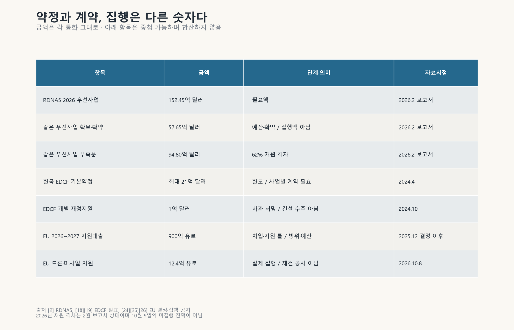

### 돈을 받는 정부는 이미 빚더미다

**우크라이나 정부는 지금 자기 수입으로 전쟁 비용조차 감당하지 못한다.**

2025년 재무부 보고서를 보면 숫자는 이렇다.[[33]](https://mof.gov.ua/storage/files/ENG_Report_on_State_Debt_and_State-Guaranteed_Debt_Management_Results_for_2025.pdf)

- 일반기금 세입(외국 보조금 제외): 2조1,323억 흐리우냐
- 일반기금 지출: 4조1,889억 흐리우냐
- 그중 군사비: 2조6,706억 흐리우냐

**자체 세입보다 군사비가 더 크다.** 보조금을 빼고 계산한 적자는 GDP의 22.9%다.

빚의 규모와 조건도 보자.

- 정부채무는 GDP의 98.2%, 정부가 보증한 채무까지 더하면 101.3%다.[[33]](https://mof.gov.ua/storage/files/ENG_Report_on_State_Debt_and_State-Guaranteed_Debt_Management_Results_for_2025.pdf)
- 2025년 채무의 약 66%가 양허성 자금(시장보다 유리한 조건의 공적 자금)이고, 새로 빌린 외부 차입의 평균 금리는 약 0.7%다.[[33]](https://mof.gov.ua/storage/files/ENG_Report_on_State_Debt_and_State-Guaranteed_Debt_Management_Results_for_2025.pdf)
- 같은 시기 국내 1년물 국채 금리는 약 16.4%였다.[[33]](https://mof.gov.ua/storage/files/ENG_Report_on_State_Debt_and_State-Guaranteed_Debt_Management_Results_for_2025.pdf)
- 2024년에는 유로본드 205억 달러를 재조정하면서 명목 채무를 37% 깎았다.[[31]](https://www.kmu.gov.ua/en/news/ukraina-zavershyla-restrukturyzatsiiu-derzhavnykh-oblihatsii-ta-harantovanykh-derzhavoiu-ievrooblihatsii-na-sumu-205-mlrd-dolariv-ssha)
- 2026~2029년에 필요한 자금은 약 1,365억 달러다. IMF의 새 프로그램은 81억 달러다.[[28]](https://www.kmu.gov.ua/en/news/minfin-rada-vykonavchykh-dyrektoriv-mvf-skhvalyla-novu-prohramu-rozshyrenoho-finansuvannia-dlia-ukrainy-u-rozmiri-81-mlrd)

평균 0.7%라는 금리는 우크라이나 사업이 안전하다는 증거가 아니다. 외국 정부가 시장보다 훨씬 싸게 빌려준다는 증거일 뿐이다.

**이런 정부가 수천억 달러의 재건비를 시장에서 정상적으로 빌린다는 그림은 성립하지 않는다.** 남는 길은 둘이다. 외국 납세자가 무상으로 대거나, 갚기 어려운 빚을 '대출'이라는 이름으로 주거나.

### '지원'이라는 말 속에 섞인 돈

| 돈의 종류 | 최종 부담자 | 흔한 착시 |
|---|---|---|
| 무상원조 | 공여국 납세자 | 필요액을 채웠다고 사업성이 생긴 것은 아님 |
| 양허성 차관 | 우크라이나 재정. 탕감되면 공여국 | 저금리를 저위험으로 오해 |
| 상업대출 | 사업 수입. 부족하면 보증자 | 은행 이름이 나오면 대출이 끝난 줄 앎 |
| 지분투자 | 투자자 | 목표 수익률을 실제 회수로 오해 |
| 혼합금융·보증 | 공공이 손실을 먼저 떠안음 | 민간 돈 전부를 자생적 사업성으로 포장 |
| PPP(민관협력) | 이용자 요금 또는 정부의 장기 지급 | 정부 부담이 사라진 줄 앎 |
| EDCF(대외경제협력기금) | 한국 공적자금 | 기본약정 한도를 수주액으로 오해 |

**민간 돈이 들어왔다고 공공 부담이 사라지지는 않는다.** 정부 보증과 첫 손실 부담, 보조금이 붙어야 성립하는 거래라면 그 돈도 결국 납세자의 돈이다.

'민간 자금이 들어온다'는 전망에도 조건이 붙어 있다. 국제금융공사(IFC)는 2023년, 개혁이 제한적이면 민간이 필요액의 18%를, 개혁이 성공하면 3분의 1을 조달할 수 있다고 봤다.[[56]](https://www.ifc.org/en/insights-reports/2023/private-sector-opportunities-for-a-green-and-resilient-reconstruction-in-ukraine) RDNA5가 제시한 '최대 40%'도 제도 개선과 위험 완화를 전제로 한다.[[2]](https://documents1.worldbank.org/curated/en/099022026094036395/pdf/P514499-22f93f3a-4278-42bc-b907-db9553d12069.pdf) **조건을 지우고 40%만 곱하면 그것은 전망이 아니라 홍보다.**

### 사업을 하나하나 열어 보면

'재건 시장'의 실체를 보려고 공개된 개별 사업 여덟 개를 확인했다. 결론부터 말하면, **2026년 현재 자기 수입으로 돈을 벌어 투자금을 회수하고 있다는 사실이 공개 자료로 입증된 사업은 하나도 없었다.**

| 사업 | 확인된 것 | 확인되지 않은 것 |
|---|---|---|
| 발전 Elementum (IFC) | 4억 유로 규모 계획. 첫 손실 보증 등 혼합금융이 포함됐고 보조금 상당액이 약 9%. 2026년 8월 기준 '서명 대기' | 전력 판매 수입과 빚 상환 능력 |
| 전력망 Ukrenergo (EBRD) | 정부보증 대출 최대 9,000만 유로 + 공여국 보조금 최대 6,000만 유로 | 송전요금으로 빚을 갚을 수 있는지 |
| 철도 기관차 (EBRD) | 정부보증 대출 최대 3억 유로 + 세계은행 보조금 최대 1억9,000만 달러로 계약 체결 | 운임으로 투자비를 회수하는 기간 |
| 도로 M15 | 2026년 6월에야 예비타당성 조사 착수 | 공사비, 경제성, 조달 방식 |
| 헤르손 항만 | 침공 전인 2020년의 운영권 계약. 2026년 정부 계획도 '자산에 접근할 수 있을 때'라는 조건부 | 현재 가동 여부와 영업 현금 |
| 미콜라이우 상하수도 (EIB) | 2024년 780만 유로 집행 | 요금 징수와 대출 상환 |
| 부차 주택 (연구 모형) | 기본 복구비 1.06억 유로에 효율 개선비 1.08억~2.12억 유로 추가. 현행 요금으로는 회수에 27~33.6년 | 실제 준공비와 에너지 절감액 |
| 리비우 M10 산업단지 | EBRD 지분 35%, MIGA 10년 전쟁보증. 1단계 가동, 2026년 3월 2단계 착공 | 임대 수입과 투자 회수 |

*출처: [[84]](https://disclosures.ifc.org/project-detail/SII/49272/elementum-debt)[[85]](https://www.ebrd.com/home/work-with-us/projects/psd/55539.html)[[86]](https://www.ebrd.com/home/news-and-events/news/2025/international-support-for-ukraine-demonstrated-through-major-rai.html)[[87]](https://pppagency.gov.ua/one-more-pilot-public-investment-project-has-begun-preparations-under-the-ukraine-government-ppf/)[[88]](https://www.ebrd.com/home/news-and-events/news/2020/ebrd-supports-first-concession-project-in-ukraine.html)[[106]](https://mindev.gov.ua/storage/app/sites/1/uploaded-files/list-ocikuvan-vlasnika-dp-sk-olviia-2026.pdf)[[89]](https://www.eib.org/en/press/all/2024-453-ukraine-eib-provides-eur14-5-million-to-support-municipal-projects-in-war-torn-cities-of-mykolaiv-and-dnipro)[[34]](https://en.ecoaction.org.ua/wp-content/uploads/2024/03/Executive_Summary_The_Green_Reconstruction_of_the_Residential_Sector.pdf)[[90]](https://www.ebrd.com/home/news-and-events/news/2023/ebrd-invests-in-developing-lviv-industrial-park-in-western-ukraine.html)[[91]](https://ukraineinvest.gov.ua/en/news/27-02-2024-1/)[[107]](https://dragon-capital.com/media/press-releases/dragon-capital-launches-construction-of-phase-ii-of-m10-lviv-industrial-park/)*

공통점이 보인다. **정부 보증, 공여국 보조금, 국제기구 보증을 빼고 나면 제 발로 서 있는 사업이 거의 없다.** 그나마 사업이 굴러갈 조건도 나빠지고 있다. 투자사 Dragon Capital은 2026년 10월 8일 전망에서, 7월 이후 공격이 격화되면서 산업생산 일부가 멈추고 항만과 에너지 사정이 악화됐다고 평가했다.[[108]](https://dragon-capital.com/media/press-releases/onovleniy-makroprognoz-na-2026-2027-roki-ekonomichni-naslidki-posilennya-atak/)

공공사업은 수익이 낮아도 할 수 있다. 다만 그럴 때는 "이건 원조이고, 납세자 돈이 든다"고 솔직하게 말해야 한다. **사업성이 약한 사업을 원조로 하는 것과, 사업성이 좋은 것처럼 민간에 파는 것은 전혀 다른 이야기다.**

---

## 6. 마리우폴: 들어갈 수도 없는 도시를 한국에 내밀었다

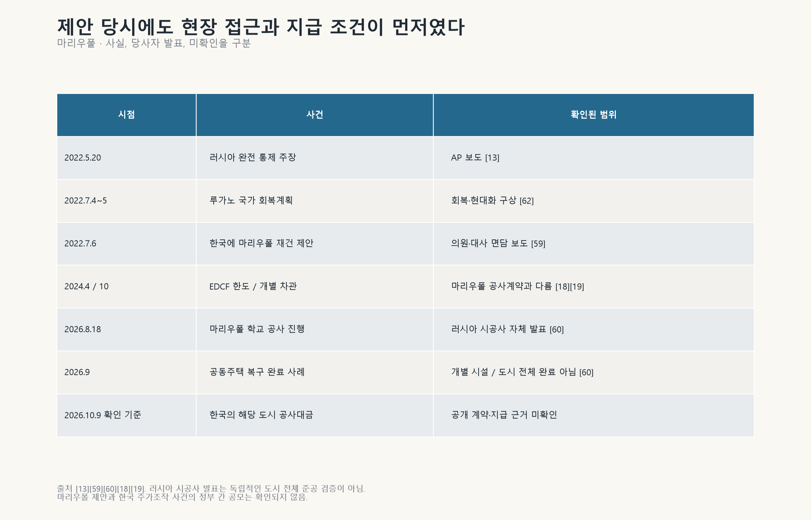

**맨 앞에서 본 2022년 7월 6일 서울의 면담으로 돌아가 보자. 우크라이나 의원들은 한국 장관에게 러시아가 점령한 도시의 재건을 맡아 달라고 했다.**

이날 원희룡 당시 국토교통부 장관은 세르기 타루타·안드리 니콜라이옌코 의원, 드미트로 포노마렌코 주한 우크라이나 대사를 만났다. 타루타 의원은 한국의 복구·신도시 경험을 살려 마리우폴을 새로운 기준으로 재건해 달라고 제안했다.[[59]](https://www.etnews.com/20220706000197)

그보다 47일 앞선 5월 20일, 러시아는 아조우스탈 제철소 함락 이후 마리우폴을 완전히 장악했다고 발표했다.[[13]](https://triblive.com/news/world/russia-claims-to-have-taken-full-control-of-mariupol) 한국 기업이 들어가 우크라이나 정부의 발주로 공사할 수 있는 도시가 아니었다.

수주 기회라고 부르려면 최소한 네 가지가 있어야 한다.

1. 현장에 언제 들어갈 수 있는가
2. 누가 합법적으로 발주하는가
3. 공사비는 어디서 나오는가
4. 대금을 지급할 주체와 계약이 있는가

공개된 면담 내용에는 이 넷 가운데 어느 것도 없었다. 있었던 것은 도시 이름과 피해 규모, 그리고 협력하겠다는 의지뿐이다.

**나는 이것을 마리우폴 재건 사기극이라고 부른다.** 우크라이나 측은 자신들이 제공할 수 없는 현장과 아직 존재하지 않는 공사대금을 '한국의 참여 기회'로 내밀었다. 한국 정부는 그것을 받아 협력 확대를 이야기했다. **책임은 요청한 쪽에만 있지 않다. 그것을 기회처럼 국민에게 전달한 쪽에도 있다.**

그 뒤 마리우폴에서 공사를 하고 있는 쪽은 러시아다. 러시아 시공사는 2026년에도 아파트와 학교의 복구 공사를 발표하고 있다.[[60]](https://rks-nr.ru/news/273/) 망명 중인 마리우폴 시의회는 점령당국이 아파트 900채를 압류했다고 주장한다.[[16]](https://euromaidanpress.com/2026/05/13/russia-seizes-900-mariupol-apartments-from-owners-it-forced-to-flee/) 언젠가 이 도시를 되찾더라도, 누구의 건물을 누구의 권리로 고칠지부터 다시 따져야 한다.

2022년의 이 제안이 한국 기업의 마리우폴 공사계약이나 대금으로 이어졌다는 기록은 공개 자료 어디에도 없다. 우크라이나 측이 한국의 테마주 세력과 짰다는 증거도 없다. 그럴 필요도 없다. **현장도 돈도 없는 제안이 '수주 기회'라는 말로 돌아다녔다는 사실만으로 충분하다.**

### 한국은 이미 충분히 냈다

**한국이 우크라이나를 적게 도왔다는 말은 틀렸다.**

2023년 12월 연합뉴스가 인용한 워싱턴포스트 보도에 따르면, 그해 한국이 간접적으로 공급한 155mm 포탄이 유럽 전체의 공급량보다 많았다.[[58]](https://m-en.yna.co.kr/view/AEN20231205000300315) 외교부는 2024년에 인도적 지원 2억 달러, 다자기구를 통한 지원 1억 달러, KOICA 사업 약 1억 달러를 설명했다.[[61]](https://www.mofa.go.kr/www/brd/m_4080/view.do?page=1&pitem=102026&seq=375100)

그렇다면 우크라이나가 한국에 내민 '재건 기회'는 어떻게 됐나.[[18]](https://www.kmu.gov.ua/en/news/ukraina-otrymaie-mozhlyvist-zaluchaty-kredytni-resursy-zahalnym-obsiahom-do-21-mlrd-vid-pivdennoi-korei-uriady-krain-pidpysaly-vidpovidnu-uhodu)[[19]](https://www.kmu.gov.ua/en/news/ukraina-vpershe-otrymaie-pilhove-finansuvannia-vid-respubliky-koreia-serhii-marchenko-pidpysav-kredytnyi-dohovir-na-100-mln-dolariv-ssha)[[20]](https://mindev.gov.ua/en/news/spivpratsia-z-koreiskymy-kompaniiamy-posylyt-stiikist-ukrainskoi-zaliznytsi-oleksii-kuleba)[[21]](https://www.koreajoongangdaily.com/business/kac-hyundai-ec-ink-983m-deal-to-revamp-kyiv-intl-airport/11017714)

- **EDCF 기본약정 21억 달러:** 우크라이나가 발표한 '최대 80억 달러'의 4분의 1 남짓이고, 그마저 쓸 수 있는 한도일 뿐이다.
- **실제로 서명된 개별 차관 1억 달러:** 건설용이 아니라 재정지원용이다.
- **보리스필 공항 9억8,300만 달러:** 양해각서(MOU)다.
- **철도차량 20편성:** 2025년 기준 차관을 요청한 단계다.

**포탄은 우회해서라도 실제로 갔다. 재건 수주는 아직 서류 위에만 있다.** 지원과 수주를 맞바꾸자는 약속이 있었던 것은 아니다. 그러나 한국에 '재건 기회'를 설명한 쪽은 이제 답해야 한다. 어느 사업이 실제로 발주됐고, 어느 돈이 우리 기업에 지급됐는가.

---

## 7. 한국에서는 기대가 먼저 현금이 됐다

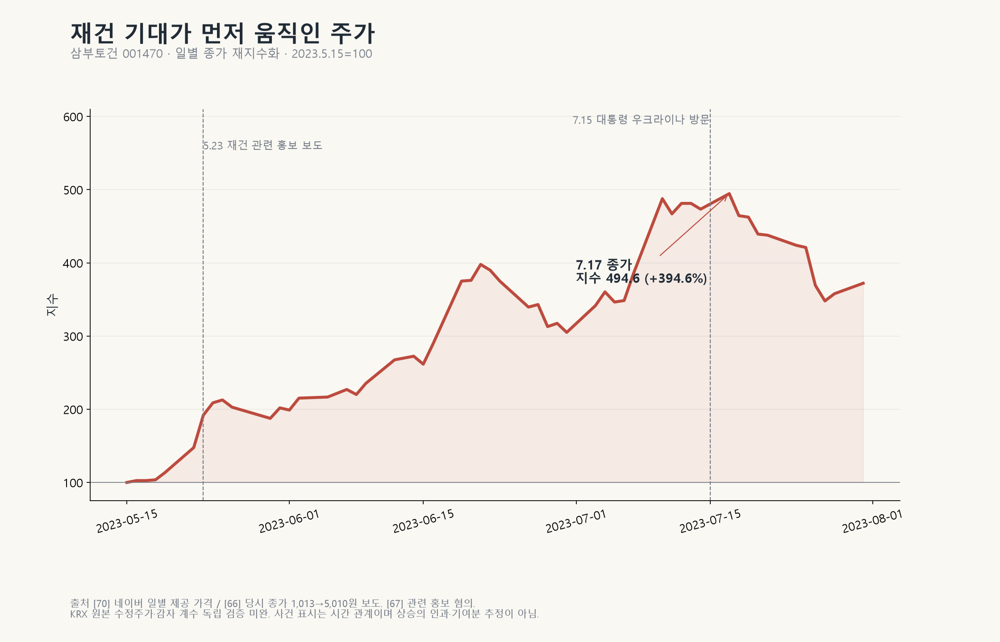

**삼부토건 주가는 2023년 5월 15일 1,013원에서 7월 17일 5,010원이 됐다. 두 달 만에 394.6%가 올랐다.** 재건 관련 행사와 정부의 우크라이나 방문을 둘러싼 기대가 이 기간에 몰렸다.[[66]](https://www.ilyo.co.kr/?ac=article_view&entry_id=479842)

이제 실적을 보자.[[65]](https://dart.fss.or.kr/report/viewer.do?rcpNo=20260814004299&dcmNo=11540645&eleId=13&offset=164355&length=24051&dtd=dart4.xsd)[[102]](https://kind.krx.co.kr/external/2026/05/15/002323/20260515005207/11013.htm)

- 2026년 반기 매출은 약 377억원이고, 그중 해외사업 매출은 0원이다.
- 2024년과 2025년의 해외사업 매출도 0원이다.
- 주요 공사 목록에 우크라이나 사업은 없다.
- 2026년 1분기 보고서에는 진행 중인 해외사업이 없다고 적혀 있다.

**주가는 다섯 배가 됐는데 우크라이나 매출은 한 푼도 없었다. 계약대금보다 주식 매각대금이 먼저 들어왔다.**

수사기관은 2025년 관련 경영진 등을 기소했다. 재건 사업을 할 능력도 의사도 없으면서 홍보로 주가를 띄운 뒤 팔았다는 혐의다. 수사기관이 계산한 부당이득은 약 369억원이다. 2026년 7월 기준으로 재판이 진행 중이며 확정판결은 아직 없다.[[67]](https://mobile.newsis.com/view_amp.html?ar_id=NISX20250926_0003345388)[[95]](https://v.daum.net/v/20260724163709596) 회사는 이후 회생절차와 대규모 감자를 거쳤다. 거래소는 2026년 9월 상장 유지 여부를 기업심사위원회 심의에 부쳤다.[[68]](https://www.mt.co.kr/amp/stock/2026/06/29/2026062916314035715)[[96]](https://dart.fss.or.kr/report/viewer.do?rcpNo=20260831800966&dcmNo=11561863&eleId=0&offset=0&length=0&dtd=HTML)[[105]](https://dart.fss.or.kr/report/viewer.do?rcpNo=20260921800376&dcmNo=11587021&eleId=0&offset=0&length=0&dtd=HTML)

웰바이오텍 주가는 2023년 5월 2일 1,458원에서 7월 28일 4,740원으로 225.1% 올랐다. 재건 기대와 짐바브웨 리튬 사업 기대가 겹쳤다. 특별검사는 부당이득을 처음에 302억원으로 봤다가 2026년 3월 공소장 변경을 신청하며 약 215억원으로 줄였다. 이 사건도 재판 중이다. 회사는 2026년 1월 상장폐지됐고, 같은 달 국보도 상장폐지됐다.[[69]](https://v.daum.net/v/VxCmJt4qcf)[[97]](https://stock.mk.co.kr/news/disclosure/template/855739)[[98]](https://v.daum.net/v/20260123105034883)

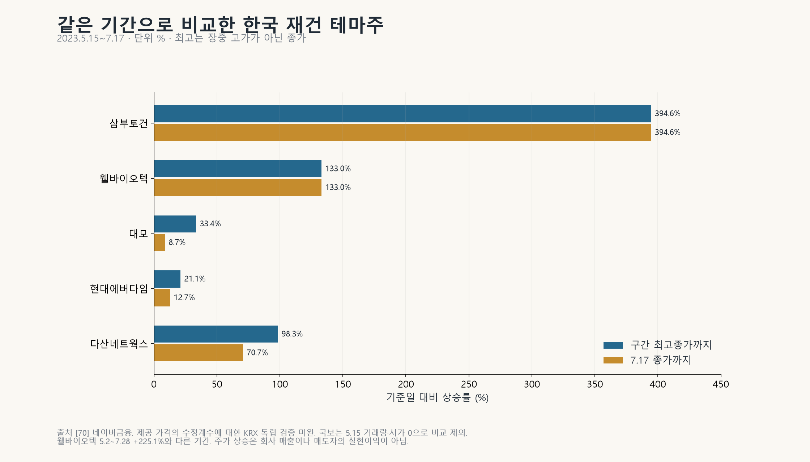

같은 기간(2023년 5월 15일~7월 17일) 재건 테마로 묶였던 종목들은 다음과 같다.[[70]](https://api.finance.naver.com/siseJson.naver?symbol=001470&requestType=1&startTime=20230515&endTime=20230731&timeframe=day)[[71]](https://www.dasannetworks.com/sub/sub03_04.php?category=2023)

| 종목 | 최고 종가까지 상승률 | 실물 사업 |
|---|---:|---|
| 삼부토건 | +394.6% | 해외매출 0원 |
| 웰바이오텍 | +133.0% | 재건·리튬 기대가 겹침. 상장폐지 |
| 다산네트웍스 | +98.3% | 전력망·통신 협력 발표. 대규모 유상 발주는 확인되지 않음 |
| 대모 | +33.4% | 굴착기 부착장비를 실제로 생산 |
| 현대에버다임 | +21.1% | 건설기계를 실제로 수출 |

실제 장비를 만드는 대모, 현대에버다임, 다산네트웍스를 삼부토건과 같은 범주로 묶을 수는 없다. 그러나 이 회사들에서도 재건 수혜가 주주의 수익으로 이어지지는 않았다. 2023년 5월 15일부터 2026년 10월 8일까지 주가는 대모 -51.3%, 현대에버다임 -13.1%, 다산네트웍스 -20.5%였다.[[70]](https://api.finance.naver.com/siseJson.naver?symbol=001470&requestType=1&startTime=20230515&endTime=20230731&timeframe=day)

**좋은 뉴스가 뜨면 주가가 뛰고, 먼저 산 사람이 판다. 늦게 들어온 사람은 사업 성과를 기다린다. 사업이 나오지 않으면 그 기다림의 비용만 남는다.** 재건이 실제로 되든 안 되든, 손익은 그 전에 이미 갈렸다.

---

## 8. 서방도 다르지 않다: 재건이 금융상품이 됐다

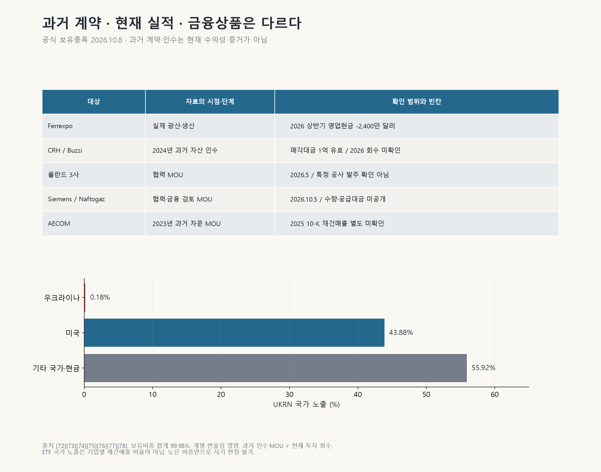

**재건 기대 장사는 한국 테마주만의 일이 아니다.**

**Ferrexpo**는 우크라이나에 실제 광산을 가진 회사다. 2025년 5월 1일 미국·우크라이나 광물협정 소식이 나오자 주가가 장중 19.52% 뛰었다.[[103]](https://www.itiger.com/news/2481271136) 그런데 2026년 상반기 실적은 이렇다.[[72]](https://www.ferrexpo.com/media/nl5nlb2l/ferrexpo-2026-interim-results_website_final.pdf)

- 생산 -54%
- 매출 -57% (약 1억9,600만 달러)
- 기초 EBITDA -400만 달러
- 영업현금흐름 -2,400만 달러

결국 회사는 9월에 1억 달러를 증자했다. **평화 뉴스에 주가는 뛰었지만 광산은 돈을 벌지 못했다.**

**HANetf의 'UKRN' 우크라이나 재건 ETF**는 2026년 3월에 출시됐다. 10월 8일 공식 보유종목 기준으로 미국 비중은 43.88%, 우크라이나 비중은 0.18%다. 담긴 종목은 Emerson, Siemens Energy, BAE Systems 같은 글로벌 대기업이다.[[73]](https://hanetf.com/fund/ukrn-defiance-ukraine-reconstruction-etf/)

이름은 우크라이나 재건인데 돈은 미국 주식으로 간다. 운용사는 재건이 되든 안 되든 연 0.65%의 보수를 받는다. 자산이 1,880만 유로라면 1년에 약 12만 유로다.[[73]](https://hanetf.com/fund/ukrn-defiance-ukraine-reconstruction-etf/)

나머지는 대부분 양해각서다.

- 폴란드 건설 3사의 재건 협력 MOU (2026년 5월)[[74]](https://www.gov.pl/web/aktywa-panstwowe/synergia-dla-odbudowy-ukrainy--podpisanie-porozumienia-o-wspolpracy-na-rzecz-odbudowy-ukrainy-w-ministerstwie-aktywow-panstwowych)
- Siemens Energy와 Naftogaz의 MOU (2026년 10월 5일). 수량·가격·금융 조건은 미정이다.[[75]](https://www.naftogaz.com/en/news/naftogaz-and-siemens-energy-sign-memorandum-on-energy-security-and-underground-gas-storage-modernisation)
- AECOM의 재건 자문 MOU (2023년). 연차보고서(10-K)에 재건 매출이 따로 공시되지 않았다.[[77]](https://aecom.com/press-releases/aecom-to-serve-as-infrastructure-delivery-advisor-for-ukraine-reconstruction/)[[78]](https://www.sec.gov/Archives/edgar/data/868857/000086885725000013/acm-20250930.htm)
- Bechtel의 MOU (2023년)[[104]](https://restoration.gov.ua/blog/agentstvo-vidnovlennya-spivpraczyuvatyme-z-liderom-u-sferi-inzhyniryngu-ta-budivnycztva-korporacziyeyu-bechtel/)

돈이 실제로 오간 사례는 따로 있다. 이탈리아 Buzzi는 2024년 우크라이나 시멘트 사업을 CRH에 1억 유로에 팔았다.[[76]](https://www.buzzi.com/w/completata-la-cessione-delle-attivita-in-ucraina) **돈을 확실히 손에 쥔 쪽은 재건에 투자한 쪽이 아니라 우크라이나에서 빠져나간 쪽이었다.**

### 서방 자본은 공사판에는 안 오고, 노른자만 집었다

"서방 기업이 재건을 핑계로 우크라이나를 다 사들였다"는 말이 돈다. 사실과 다르다. 미국 기업들이 농지 1,700만ha를 샀다는 소문은 팩트체크에서 거짓으로 판명됐고, 우크라이나 법은 외국인의 농지 소유를 막고 있다.[[116]](https://fullfact.org/news/ukraine-land-sales-zelenskyy/) 블랙록이 설계하던 우크라이나 개발펀드는 투자자가 모이지 않아 2025년 1월 투자자 모집이 멈췄다.[[111]](https://www.pravda.com.ua/eng/news/2025/07/5/7520332/) 국영기업 민영화에도 외국 투자자는 거의 입질을 하지 않는다.[[115]](https://kyivindependent.com/ukraine-wants-foreign-investors-to-buy-its-state-assets-so-far-theyre-not-biting/)

진짜 문제는 그 반대편에 있다. **위험한 공사판에는 서방 민간 돈이 들어오지 않았다. 대신 돈이 되는 자원은 먼저 챙겨졌다.**

2025년 4월 미국과 우크라이나는 광물협정을 맺었다. 앞으로 새로 내주는 광물·석유·가스 개발권에서 우크라이나가 받는 수입의 절반을 공동 투자펀드에 넣고, 미국은 자기 몫의 출자를 군사지원으로 셈할 수 있는 구조다.[[112]](https://www.aljazeera.com/amp/news/2025/5/1/what-is-in-the-us-ukraine-minerals-deal) 이 펀드의 첫 투자처는 재건 사업이 아니라 군사 드론의 무선조종 장비 업체였다.[[29]](https://home.treasury.gov/news/press-releases/sb0424)

2026년 1월에는 우크라이나 최대급 리튬 광상인 도브라의 개발권이 TechMet와 The Rock Holdings의 컨소시엄에 돌아갔다. TechMet는 미국 정부 기관인 국제개발금융공사(DFC)가 지분을 가진 회사다. 뉴욕타임스는 이 컨소시엄이 트럼프 대통령의 오랜 친구인 로널드 로더와 연결돼 있다고 보도했다. 그런데 공동펀드를 관리하는 기관도 같은 DFC다. 우크라이나 정부는 특혜가 아니라 심사에서 이긴 것이라고 반박했다. 약속된 투자는 최소 1억7,900만 달러이고, 생산분배계약의 조건은 공개되지 않았다.[[113]](https://kyivindependent.com/ukraine-to-attract-179-million-u-s-investment-in-key-lithium-deposit/)[[114]](https://www.pravda.com.ua/eng/news/2026/01/12/8015797/)

**손실 위험이 큰 공사는 공공의 돈으로, 노른자 자원은 미국 정부 기관과 정권 인맥이 얽힌 자본에게. 재건이라는 이름 아래 벌어지고 있는 배분이다.**

재건으로 먼저 돈을 버는 길은 정해져 있다. 자문료, 금융상품 보수, 자산 매각대금, 기대감에 오른 주식의 매도 차익. 모두 재건이 성공할 때까지 기다리지 않아도 되는 돈이다. 반대로 사업 운영자와 대출 보증자, 늦게 들어온 투자자, 공여국 납세자는 끝까지 기다려야 한다.

---

## 9. 러시아 돈은 공짜 재원이 아니다

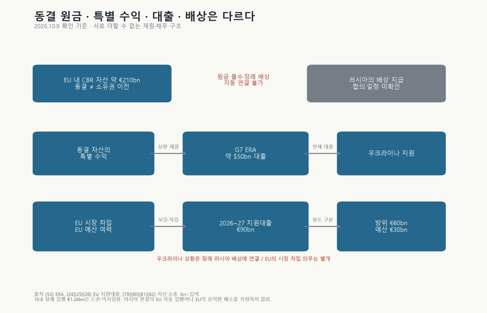

**돈 이야기가 막힐 때마다 나오는 답이 있다. "러시아 동결자산을 쓰면 된다." 이것은 답이 아니라 또 하나의 빈칸이다.**

EU 안에 동결된 러시아 중앙은행 자산은 약 2,100억 유로다.[[53]](https://economy-finance.ec.europa.eu/international-economic-relations/candidate-and-neighbouring-countries/ukraine_en) 그러나 동결은 묶어 둔 것이지 빼앗은 것이 아니다. 소유권은 여전히 러시아에 있고, 러시아가 이 돈을 배상금으로 내겠다고 합의한 적도 없다.

지금 실제로 쓰이는 것은 원금이 아니다.

- **G7의 ERA 대출(약 500억 달러):** 동결자산에서 나오는 수익으로 갚는 대출이다. 수익이 줄면 부족분은 누군가 메워야 한다.[[53]](https://economy-finance.ec.europa.eu/international-economic-relations/candidate-and-neighbouring-countries/ukraine_en)
- **EU의 900억 유로 대출(2026~2027년):** 러시아 자산이 아니라 EU가 시장에서 빌린 돈이다. 우크라이나는 러시아가 배상해야 갚는다.[[24]](https://www.eeas.europa.eu/delegations/ukraine/european-council-18-december-2025-ukraine_en)[[25]](https://www.kmu.gov.ua/en/news/minfin-vitaie-rishennia-rady-ies-shchodo-namiru-nadaty-ukraini-90-mlrd-ievro-finansovoi-dopomohy-na-2026-2027-roky) **러시아가 끝내 배상하지 않으면 EU가 진 빚은 그대로 EU 납세자에게 남는다.**

게다가 900억 유로 가운데 600억 유로는 방위비, 300억 유로는 예산 지원이다. 2026년 10월 8일 실제로 집행된 12억4,000만 유로도 드론과 미사일 몫이었다.[[26]](https://defence-industry-space.ec.europa.eu/commission-disburses-eur124-billion-ukraine-drones-and-missiles-2026-10-08_en) 재건 공사비가 아니다.

소송도 걸려 있다.

- 러시아 중앙은행은 모스크바 법원에서 Euroclear를 상대로 약 18조2,000억 루블을 청구했다. 2026년 5월 1심에서 이겼고, Euroclear는 7월 항소가 기각됐다고 밝혔다.[[79]](https://www.euroclear.com/newsandinsights/en/press/2026/mr-20-euroclear-h1-2026-results.html)[[80]](https://www.cbr.ru/eng/press/PR/?file=639011472901412429OBAUT_E.htm)[[101]](https://apnews.com/article/85750e45d2da06168a72aeb8f41ec53b)
- EU 법원에는 러시아 중앙은행이 낸 동결 조치 취소소송(T-150/26)이 걸려 있다.[[81]](https://www.cbr.ru/eng/press/pr/?file=639080409737537862OBAUT_E.htm)[[82]](https://eur-lex.europa.eu/legal-content/EN/CASE/?uri=oj%3AC_202602053)
- Euroclear는 브뤼셀 법원에 맞소송을 냈다.[[83]](https://www.brusselstimes.com/world/2209129/euroclear-sues-russian-central-bank-in-brussels-court)

결과를 예단할 수는 없다. 그러나 하나는 분명하다. **러시아 돈을 재건 재원이라고 부르는 순간, 공사장 위험 위에 소송 위험과 금융 위험이 함께 얹힌다.**

---

## 10. 지어 놓으면 누가 쓰나

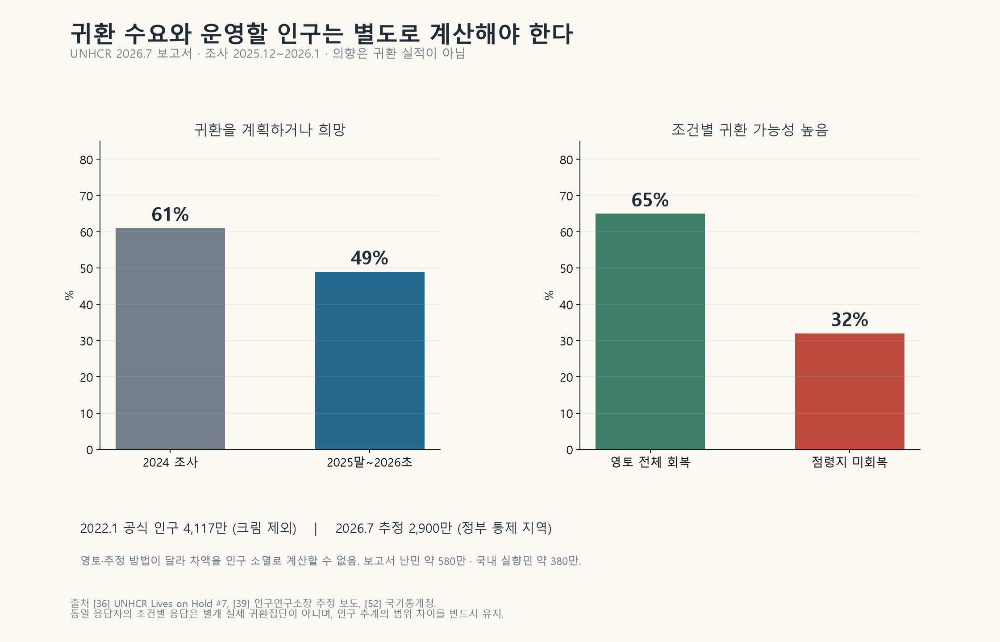

**건물은 사람이 써야 돈이 된다. 그런데 우크라이나에서는 그 사람이 줄고 있다.**

- 2022년 1월 공식 인구는 약 4,117만 명(크림 제외)이었다. 2026년 7월 정부 통제 지역의 인구 추정치는 약 2,900만 명이다. 집계 범위가 달라 차이 전부를 인구 감소로 볼 수는 없지만, 지금 시설을 쓸 사람이 전쟁 전과 다르다는 것은 분명하다.[[39]](https://en.interfax.com.ua/news/general/1186657.html)[[52]](https://lv.ukrstat.gov.ua/ukr/help/pb_fig2021/en/chapter_2_1.html)
- 해외 난민은 약 580만 명, 국내 실향민은 약 380만 명이다.[[36]](https://data.unhcr.org/en/documents/download/123284)
- 귀국을 계획하거나 희망하는 난민은 49%다. 점령지를 되찾지 못한 채 전쟁이 끝나면, 귀국 가능성이 높다는 응답은 32%로 떨어진다.[[36]](https://data.unhcr.org/en/documents/download/123284)
- 취업자는 약 1,070만 명, 연금 수급자는 약 1,020만 명이다. 이 가운데 약 280만 명은 일하는 연금 수급자로 양쪽에 겹친다.[[41]](https://kse.ua/about-the-school/news/human-capital-trends-in-ukraine-make-reforms-of-the-labour-market-social-benefits-system-and-education-funding-key-priorities-for-2026-human-capital-chartbook-kse-institute/) 일할 사람과 세원이 줄어드는 가운데 국방·연금·재건이 같은 지갑을 놓고 다툰다.

필요액의 약 19%는 도네츠크주, 6%는 루한스크주 몫이다.[[2]](https://documents1.worldbank.org/curated/en/099022026094036395/pdf/P514499-22f93f3a-4278-42bc-b907-db9553d12069.pdf) 그런데 2026년 초 기준으로 도네츠크주의 78%, 루한스크주의 99.6%가 러시아 점령지다.[[42]](https://news.online.ua/en/deepstate-calculated-the-area-of-ukraine-occupied-by-the-russian-federation-in-2025-900209/) **조사는 할 수 있다. 그러나 들어갈 수 없는 땅의 필요액은 시장이 아니다.**

세계은행조차 현재와 앞으로의 인구를 보고 과잉 투자를 피하라고 권했다. 전쟁 전 도시 배치를 그대로 복제하지 말라는 연구도 있다.[[2]](https://documents1.worldbank.org/curated/en/099022026094036395/pdf/P514499-22f93f3a-4278-42bc-b907-db9553d12069.pdf)[[43]](https://www.nber.org/papers/w34598) 그런데 5,877억 달러를 귀국 시나리오별로 나눈 현금흐름표도, 새 시설의 연간 운영·유지비 합계도 어디에도 없다.

병원에는 의사가, 학교에는 교사가, 도로에는 보수비가, 수도에는 전기와 약품이 든다. 건설비는 원조로 받아도 운영비는 해마다 나간다. **운영비를 설명하지 않는 재건은 전쟁 전의 '낡은 시설' 문제를 새 시설에서 되풀이한다.**

부패는 이 현금흐름을 직접 갉아먹는다. 반부패수사국(NABU)은 2025년 11월 '미다스' 사건을 공개했다. 국영 원전기업 Energoatom의 협력업체들에 10~15%의 리베이트를 요구하고 약 1억 달러를 세탁한 조직이 있었다는 혐의다. 2026년 7월에는 추가 혐의 통지도 나왔다.[[92]](https://nabu.gov.ua/en/news/operatciia-midas-vykryto-vysokorivnevu-zlochynnu-organizatciiu-shcho-diiala-u-sferi-energetyky/)[[93]](https://nabu.gov.ua/en/news/operatciia-midas-nova-pidozra/)

아직 혐의 단계다. 그러나 납품하고도 리베이트를 내야 대금을 받는 구조라면 그 비용은 결국 계약가격과 금융비용에 얹힌다. 국제투명성기구가 발표한 2025년 부패인식지수(36점)는 2025년 9월까지의 자료여서 이 사건을 반영하지도 못했다.[[46]](https://ti-ukraine.org/en/research/corruption-perceptions-index-2025/)

---

## 11. 이익은 먼저, 위험은 나중에, 서로 다른 사람에게

**재건을 '좋은 일' 하나로만 말하면 모두가 한편처럼 보인다. 실제로는 돈을 받는 순서와 위험을 지는 순서가 정반대다.**

| 먼저 돈을 받는 쪽 | 나중에 위험을 지는 쪽 |
|---|---|
| 테마주를 일찍 샀다가 판 사람 | 늦게 산 투자자 |
| 금융상품 운용사 (보수) | 현장 사업자와 대출 보증자 |
| 자문·준비 용역사 | 공여국 예산과 납세자 |
| 우크라이나 자산을 판 기업 | 시설이 돌아가지 않을 때의 우크라이나 주민 |

우크라이나 정부에는 전쟁의 절박함을 국가개발 자금 조달의 명분으로 넓힐 유인이 있다. 공여국 정치인에게는 지원을 '우리 기업의 수주 기회'로 포장할 유인이 있다. 그래야 외교적 지출이 상업적 투자처럼 들리기 때문이다. **이 유인들이 맞물려 만들어 낸 것이 지금의 재건 담론이다.**

---

## 12. 왜 사기극인가

정리하자.

1. 우크라이나는 수천억 달러짜리 재건 시장이 열린다고 떠벌리며, 참여 기회를 나눠 주는 쪽처럼 굴었다.
2. 그러나 우크라이나는 전쟁 전부터 30년 동안 투자를 미뤄 온 나라였다.
3. 전쟁이 그 위에 막대한 파괴를 더했다.
4. 우크라이나 정부는 원상복구가 아니라 국가개발 계획을 내밀고, 그 돈의 3분의 2를 외부에 기대했다.
5. 그 필요액이 '시장 규모'로 둔갑했다. 사회보호와 지뢰 제거까지 들어 있는 숫자가 기업의 먹거리로 불렸다.
6. 들어갈 수도 없는 마리우폴이 한국에 '기회'로 제시됐다.
7. 한국에서는 해외매출 0원인 회사의 주가가 다섯 배가 됐고, 서방에서는 우크라이나 비중 0.18%짜리 '재건 ETF'가 팔렸다. 공사판에 민간 돈은 오지 않았는데, 알짜 리튬 광상은 미국 정권 인맥이 얽힌 컨소시엄에 먼저 갔다.
8. 마지막 빈칸은 아직 누구의 것도 아닌 러시아 돈으로 채워졌다.

**오래 미룬 개발 부담을 재건의 명분으로 부풀린다. 아직 없는 돈을 시장처럼 설명한다. 실물보다 기대를 먼저 팔아 수익을 챙긴다. 그리고 운영과 회수의 위험은 다른 사람에게 떠넘긴다.** 내가 이 구조를 21세기 최악의 사기극이라고 부르는 이유다.

모든 재건 사업이 가짜라는 말이 아니다. 우크라이나 정부가 한국의 주가조작에 가담했다는 말도 아니다. 그런 주장까지 할 필요가 없다. 공개된 계획과 조달 구조, 그리고 실제 계약·공시 사이에 벌어진 간격만으로도 충분히 크다.

그러니 각자에게 요구한다.

- **한국 정부는** 어느 사업에 어떤 돈이 지급됐는지부터 공개하라.
- **기업은** 재건 수혜를 말하려면 계약서와 매출, 대금 회수 경로를 내놓아라.
- **우크라이나 정부는** 외부 자금을 요청하려면 자체 부담과 이용 수요, 요금과 유지비를 먼저 설명하라.
- **러시아 돈을 재원으로 말하는 사람은** 지금 쓸 수 있는 돈과 미래의 가정을 구분하라.

**우크라이나가 그 돈을 필요로 한다는 사실이 다른 나라가 그 돈을 내야 할 이유가 되지는 않는다.**

**재건으로 미래에 돈을 벌겠다는 사업보다, 재건될 것이라는 기대만으로 오늘 돈을 버는 사업이 먼저 성행하고 있다. 그 구조가 바로 사기극이다.**

우크라이나를 재건하는 비용은 누가 부담해야 하는가. 그리고 국제사회는 어느 순간부터 전쟁 피해 복구가 아니라 한 국가의 미래 개발계획 전체를 지원하는 위치에 서게 되었는가?

---

자료의 원문 확인 결과와 주장별 판정은 [출처·팩트체크](sources_and_factcheck.md)에, 확인하지 못한 내용은 [미확인 주장](unverified_claims.md)에 정리했다. 세부 분석은 부록으로 따로 묶었다: [18개 부문·개별 사업성](sector_business_analysis.md), [주가·기업 사례](stock_market_cases.md), [러시아 자산의 법률·금융 쟁점](russian_assets_legal_risks.md).

### 출처

- **[1]** 세계은행, Updated Ukraine Recovery and Reconstruction Needs Assessment Released (2026.2.23): [원문1](https://www.worldbank.org/en/news/press-release/2026/02/23/updated-ukraine-recovery-and-reconstruction-needs-assessment-released)
- **[2]** 세계은행·우크라이나 정부·EU·UN, Ukraine Fifth Rapid Damage and Needs Assessment (RDNA5) 보고서 (2026.2): [원문1](https://documents1.worldbank.org/curated/en/099022026094036395/pdf/P514499-22f93f3a-4278-42bc-b907-db9553d12069.pdf)
- **[3]** 우크라이나 경제·환경·농업부, Ukraine Prosperity Plan 발표 (2026.1.3): [원문1](https://me.gov.ua/News/Detail/a39127c6-0df8-4880-b795-74150fd0c278?isSpecial=true&lang=uk-UA&title=UkraineProsperityPlan)
- **[4]** 세계은행, Ukraine Systematic Country Diagnostic 2021 Update (2021.7~9 협의): [원문1](https://www.worldbank.org/en/brief/2021/09/06/scd-consultations) · [원문2](https://thedocs.worldbank.org/en/doc/76b8952cdeee76b061cb9ced4baaee80-0080062021/original/Ukraine-SCD-2021-en.pdf)
- **[5]** 세계은행 WDI; 1990~2021, 2026.10.9 조회: [원문1](https://api.worldbank.org/v2/country/UKR;POL;CZE;SVK;ROU;MDA;EST;LVA;LTU/indicator/NY.GDP.MKTP.KD?format=json&date=1990:2021&per_page=20000)
- **[6]** 우크라이나 내각 명령 No.388-р, '우크라이나 식수' 국가프로그램 개념 (2021.4.28): [원문1](https://zakon.rada.gov.ua/laws/show/388-2021-р)
- **[7]** ZN.ua, 할루셴코 에너지부 장관 "화력발전 설비 90% 수명 소진" (2021.6.18): [원문1](https://zn.ua/ECONOMICS/v-ukraine-90-enerhoblokov-tes-otrabotali-svoj-resurs-halushchenko.html)
- **[8]** GMK Center, 우크라이나 철도 기관차 노후화 (2020.10.2): [원문1](https://gmk.center/?p=32065)
- **[12]** 국토교통부 보도참고자료 「한-우크라, 전후 재건사업 협력 구체화」 (2022.7.6): [원문1](https://www.molit.go.kr/USR/NEWS/m_72/dtl.jsp?id=95086933)
- **[13]** AP, Russia claims to have taken full control of Mariupol (2022.5.20): [원문1](https://triblive.com/news/world/russia-claims-to-have-taken-full-control-of-mariupol)
- **[16]** Euromaidan Press, 마리우폴 아파트 900채 압류 (마리우폴 시의회 발표 인용, 2026.5.13): [원문1](https://euromaidanpress.com/2026/05/13/russia-seizes-900-mariupol-apartments-from-owners-it-forced-to-flee/)
- **[18]** 우크라이나 내각, 한국과 최대 21억 달러 EDCF 기본약정 서명 (2024.4.19): [원문1](https://www.kmu.gov.ua/en/news/ukraina-otrymaie-mozhlyvist-zaluchaty-kredytni-resursy-zahalnym-obsiahom-do-21-mlrd-vid-pivdennoi-korei-uriady-krain-pidpysaly-vidpovidnu-uhodu)
- **[19]** 우크라이나 내각, 한국 수출입은행과 1억 달러 차관계약 서명 (2024.10.2): [원문1](https://www.kmu.gov.ua/en/news/ukraina-vpershe-otrymaie-pilhove-finansuvannia-vid-respubliky-koreia-serhii-marchenko-pidpysav-kredytnyi-dohovir-na-100-mln-dolariv-ssha)
- **[20]** 우크라이나 지역개발부, 쿨레바 부총리 방한·철도차량 협력 (2025.9.17): [원문1](https://mindev.gov.ua/en/news/spivpratsia-z-koreiskymy-kompaniiamy-posylyt-stiikist-ukrainskoi-zaliznytsi-oleksii-kuleba)
- **[21]** Korea JoongAng Daily, KAC·현대건설 보리스필 공항 MOU (2023.11): [원문1](https://www.koreajoongangdaily.com/business/kac-hyundai-ec-ink-983m-deal-to-revamp-kyiv-intl-airport/11017714)
- **[24]** EEAS, European Council 18 December 2025 – Ukraine (2025.12.18): [원문1](https://www.eeas.europa.eu/delegations/ukraine/european-council-18-december-2025-ukraine_en)
- **[25]** 우크라이나 재무부, EU 900억 유로 지원 결정 환영 (2025.12.19): [원문1](https://www.kmu.gov.ua/en/news/minfin-vitaie-rishennia-rady-ies-shchodo-namiru-nadaty-ukraini-90-mlrd-ievro-finansovoi-dopomohy-na-2026-2027-roky)
- **[26]** 유럽연합 집행위원회 DG DEFIS, EUR 1.24 billion disbursement (2026.10.8): [원문1](https://defence-industry-space.ec.europa.eu/commission-disburses-eur124-billion-ukraine-drones-and-missiles-2026-10-08_en)
- **[28]** 우크라이나 재무부, IMF 신규 프로그램 승인 (2026.2.27): [원문1](https://www.kmu.gov.ua/en/news/minfin-rada-vykonavchykh-dyrektoriv-mvf-skhvalyla-novu-prohramu-rozshyrenoho-finansuvannia-dlia-ukrainy-u-rozmiri-81-mlrd)
- **[29]** 미 재무부, 미·우크라이나 재건투자기금 첫 투자(Sine Engineering, 드론 무선조종 장비) (2026.3): [원문1](https://home.treasury.gov/news/press-releases/sb0424)
- **[31]** 우크라이나 내각, 205억 달러 유로본드 구조조정 완료 (2024.9): [원문1](https://www.kmu.gov.ua/en/news/ukraina-zavershyla-restrukturyzatsiiu-derzhavnykh-oblihatsii-ta-harantovanykh-derzhavoiu-ievrooblihatsii-na-sumu-205-mlrd-dolariv-ssha)
- **[33]** 우크라이나 재무부, 2025년 국가채무 관리 결과 보고서 (2026): [원문1](https://mof.gov.ua/storage/files/ENG_Report_on_State_Debt_and_State-Guaranteed_Debt_Management_Results_for_2025.pdf)
- **[34]** Berlin Economics·Ecoaction, The Green Reconstruction of the Residential Sector (2024.3): [원문1](https://en.ecoaction.org.ua/wp-content/uploads/2024/03/Executive_Summary_The_Green_Reconstruction_of_the_Residential_Sector.pdf)
- **[36]** UNHCR, Lives on Hold #7 (2026.7): [원문1](https://data.unhcr.org/en/documents/download/123284)
- **[39]** Interfax-Ukraine, 리바노바 "정부 통제지역 인구 약 2,900만" (2026.7.20): [원문1](https://en.interfax.com.ua/news/general/1186657.html)
- **[41]** KSE Institute, Human Capital Chartbook (2026.3.10): [원문1](https://kse.ua/about-the-school/news/human-capital-trends-in-ukraine-make-reforms-of-the-labour-market-social-benefits-system-and-education-funding-key-priorities-for-2026-human-capital-chartbook-kse-institute/)
- **[42]** online.ua, DeepState 집계 2026.1.1 기준 점령 면적(도네츠크 78.1%, 루한스크 99.6%) (2026.1.6): [원문1](https://news.online.ua/en/deepstate-calculated-the-area-of-ukraine-occupied-by-the-russian-federation-in-2025-900209/)
- **[43]** Glaeser·Kirchberger·Parkhomenko, Rebuilding Ukraine's Cities, NBER WP 34598 (2025.12): [원문1](https://www.nber.org/papers/w34598)
- **[46]** TI Ukraine, Corruption Perceptions Index 2025 (2026.2.10): [원문1](https://ti-ukraine.org/en/research/corruption-perceptions-index-2025/)
- **[48]** Kyiv Independent, What we know about Ukraine's $800 billion economic peace plan (2026.1.8; 전쟁 전 GDP의 약 4배): [원문1](https://kyivindependent.com/what-we-know-about-ukraines-800-billion-economic-peace-plan/)
- **[50]** Kyiv Post, 루가노 지역 후원(patronage) 구상과 그 폐기 (2024.3.24): [원문1](https://www.kyivpost.com/post/29917)
- **[52]** 우크라이나 국가통계청, 2022.1.1 현재인구: [원문1](https://lv.ukrstat.gov.ua/ukr/help/pb_fig2021/en/chapter_2_1.html)
- **[53]** 유럽연합 집행위원회 DG ECFIN, G7 ERA 대출 개요: [원문1](https://economy-finance.ec.europa.eu/international-economic-relations/candidate-and-neighbouring-countries/ukraine_en)
- **[56]** IFC, Private Sector Opportunities for a Green and Resilient Reconstruction in Ukraine (2023; RDNA2 기준 시나리오 분석): [원문1](https://www.ifc.org/en/insights-reports/2023/private-sector-opportunities-for-a-green-and-resilient-reconstruction-in-ukraine)
- **[58]** 연합뉴스, S. Korea indirectly supplied more 155-mm shells for Ukraine than all European countries combined: WP (2023.12.5; WP 취재 인용): [원문1](https://m-en.yna.co.kr/view/AEN20231205000300315)
- **[59]** 전자신문, 국토부, 우크라이나 재건협의체 구성…마리우폴시 재건 맡아달라 (2022.7.6; 국토부 발표 인용): [원문1](https://www.etnews.com/20220706000197)
- **[60]** 러시아 시공사 РКС-НР 자체 사업 공지: 마리우폴 학교 복구공사 진행 (2026.8.18): [원문1](https://rks-nr.ru/news/273/) · [원문2](https://rks-nr.ru/news/)
- **[61]** 외교부, 우크라이나 지원에 대한 우리나라의 변함없는 의지 강조 (2024.6.13; 분야별 지원·사업·약정 설명): [원문1](https://www.mofa.go.kr/www/brd/m_4080/view.do?page=1&pitem=102026&seq=375100)
- **[62]** 우크라이나 국가회복위원회, Ukraine's Recovery Plan blueprint (URC2022 루가노, 2022.7), 2·8·10~12·17·20~24·34~36쪽: [원문1](https://cdn.prod.website-files.com/621f88db25fbf24758792dd8/62c166751fcf41105380a733_NRC%20Ukraine%27s%20Recovery%20Plan%20blueprint_ENG.pdf)
- **[63]** UkraineInvest, 루가노 850개 사업과 단계(2022.7.15): [원문1](https://ukraineinvest.gov.ua/en/news/15-07-22-2/)
- **[64]** KSE, 2022.6.13 피해 추정과 국가 계획의 범위: [원문1](https://kse.ua/russia-will-pay/)
- **[65]** 삼부토건 반기보고서(2026.8.14), II.4 매출·수주: [원문1](https://dart.fss.or.kr/report/viewer.do?rcpNo=20260814004299&dcmNo=11540645&eleId=13&offset=164355&length=24051&dtd=dart4.xsd)
- **[66]** 일요신문, 삼부토건 2023년 당시 주가·매매 보도(2024.10.11): [원문1](https://www.ilyo.co.kr/?ac=article_view&entry_id=479842)
- **[67]** 뉴시스, 삼부토건 기소 내용·369억원 혐의(2025.9.26): [원문1](https://mobile.newsis.com/view_amp.html?ar_id=NISX20250926_0003345388)
- **[68]** 머니투데이, 삼부토건 회생·감자(2026.6.29): [원문1](https://www.mt.co.kr/amp/stock/2026/06/29/2026062916314035715)
- **[69]** 조선비즈, 웰바이오텍 공소장 변경 신청(2026.3.11): [원문1](https://v.daum.net/v/VxCmJt4qcf)
- **[70]** 네이버금융 일별 가격 API(2026.10.9 조회; KRX 수정계수 독립 검증 미완료): [원문1](https://api.finance.naver.com/siseJson.naver?symbol=001470&requestType=1&startTime=20230515&endTime=20230731&timeframe=day) · [원문2](https://api.finance.naver.com/siseJson.naver?symbol=317850&requestType=1&startTime=20230515&endTime=20261008&timeframe=day) · [원문3](https://api.finance.naver.com/siseJson.naver?symbol=041440&requestType=1&startTime=20230515&endTime=20261008&timeframe=day) · [원문4](https://api.finance.naver.com/siseJson.naver?symbol=039560&requestType=1&startTime=20230515&endTime=20261008&timeframe=day)
- **[71]** 다산네트웍스 2023년 회사 발표·사업보고서: [원문1](https://www.dasannetworks.com/sub/sub03_04.php?category=2023) · [원문2](https://www.dasannetworks.com/) · [원문3](https://kind.krx.co.kr/external/2024/03/21/001479/20240321005920/11011.htm)
- **[72]** Ferrexpo 2026년 중간 실적(2026.9.25): [원문1](https://www.ferrexpo.com/media/nl5nlb2l/ferrexpo-2026-interim-results_website_final.pdf)
- **[73]** HANetf UKRN 공식 상품 페이지·보유종목 파일: [원문1](https://hanetf.com/fund/ukrn-defiance-ukraine-reconstruction-etf/) · [원문2](https://etf.hanetf.com/Holdings-UKRN-IE000R8PO127-all-all) · [원문3](https://etf.hanetf.com/Factsheet-UKRN-IE000R8PO127-en)
- **[74]** 폴란드 국유자산부, 3사 재건 협력 MOU(2026.5.15): [원문1](https://www.gov.pl/web/aktywa-panstwowe/synergia-dla-odbudowy-ukrainy--podpisanie-porozumienia-o-wspolpracy-na-rzecz-odbudowy-ukrainy-w-ministerstwie-aktywow-panstwowych)
- **[75]** Naftogaz, Siemens Energy MOU(2026.10.5): [원문1](https://www.naftogaz.com/en/news/naftogaz-and-siemens-energy-sign-memorandum-on-energy-security-and-underground-gas-storage-modernisation)
- **[76]** Buzzi, 우크라이나 사업 매각 완료(2024.10.14): [원문1](https://www.buzzi.com/w/completata-la-cessione-delle-attivita-in-ucraina)
- **[77]** AECOM, 재건 인프라 자문 MOU(2023.6.20): [원문1](https://aecom.com/press-releases/aecom-to-serve-as-infrastructure-delivery-advisor-for-ukraine-reconstruction/)
- **[78]** AECOM 2025 Form 10-K: [원문1](https://www.sec.gov/Archives/edgar/data/868857/000086885725000013/acm-20250930.htm)
- **[79]** Euroclear 2026년 상반기 실적·법률 대응: [원문1](https://www.euroclear.com/newsandinsights/en/press/2026/mr-20-euroclear-h1-2026-results.html)
- **[80]** 러시아 중앙은행, 모스크바 소송 발표(2025.12.12): [원문1](https://www.cbr.ru/eng/press/PR/?file=639011472901412429OBAUT_E.htm)
- **[81]** 러시아 중앙은행, EU 법원 제소 발표(2026.3.3): [원문1](https://www.cbr.ru/eng/press/pr/?file=639080409737537862OBAUT_E.htm)
- **[82]** EU 관보, 사건 T-150/26, 2026.4.13 공고: [원문1](https://eur-lex.europa.eu/legal-content/EN/CASE/?uri=oj%3AC_202602053)
- **[83]** Brussels Times/Belga, 브뤼셀 대응소송(2026.6.30): [원문1](https://www.brusselstimes.com/world/2209129/euroclear-sues-russian-central-bank-in-brussels-court)
- **[84]** IFC, Elementum SII 49272; 2026.8.6 갱신: [원문1](https://disclosures.ifc.org/project-detail/SII/49272/elementum-debt)
- **[85]** EBRD, Ukrenergo PSD 55539(2025.12 승인): [원문1](https://www.ebrd.com/home/work-with-us/projects/psd/55539.html)
- **[86]** EBRD, 기관차 계약·국제 금융지원(2025): [원문1](https://www.ebrd.com/home/news-and-events/news/2025/international-support-for-ukraine-demonstrated-through-major-rai.html)
- **[87]** 우크라이나 PPP Agency, M15 예비타당성 조사(2026.6.17): [원문1](https://pppagency.gov.ua/one-more-pilot-public-investment-project-has-begun-preparations-under-the-ukraine-government-ppf/)
- **[88]** EBRD, 헤르손 항만 양허(2020): [원문1](https://www.ebrd.com/home/news-and-events/news/2020/ebrd-supports-first-concession-project-in-ukraine.html)
- **[89]** EIB, 미콜라이우·드니프로 집행(2024.11.19): [원문1](https://www.eib.org/en/press/all/2024-453-ukraine-eib-provides-eur14-5-million-to-support-municipal-projects-in-war-torn-cities-of-mykolaiv-and-dnipro)
- **[90]** EBRD, M10 리비우 산업단지 투자(2023): [원문1](https://www.ebrd.com/home/news-and-events/news/2023/ebrd-invests-in-developing-lviv-industrial-park-in-western-ukraine.html)
- **[91]** UkraineInvest, M10 1단계 개장(2024.2.27): [원문1](https://ukraineinvest.gov.ua/en/news/27-02-2024-1/)
- **[92]** NABU, 미다스 최초 혐의 발표(2025.11.11): [원문1](https://nabu.gov.ua/en/news/operatciia-midas-vykryto-vysokorivnevu-zlochynnu-organizatciiu-shcho-diiala-u-sferi-energetyky/)
- **[93]** NABU, 미다스 추가 혐의(2026.7.10): [원문1](https://nabu.gov.ua/en/news/operatciia-midas-nova-pidozra/)
- **[95]** 한국일보, 삼부토건 사건 재판 진행(2026.7.24): [원문1](https://v.daum.net/v/20260724163709596)
- **[96]** KRX 기타시장안내, 삼부토건(2026.8.31): [원문1](https://dart.fss.or.kr/report/viewer.do?rcpNo=20260831800966&dcmNo=11561863&eleId=0&offset=0&length=0&dtd=HTML)
- **[97]** KRX 웰바이오텍 상장폐지 공고 재게재, 2026.1.26 폐지: [원문1](https://stock.mk.co.kr/news/disclosure/template/855739)
- **[98]** 국보 상장폐지 보도(2026.1.23): [원문1](https://v.daum.net/v/20260123105034883)
- **[101]** AP, 러시아 법원 Euroclear 사건 판단(2026.5.15): [원문1](https://apnews.com/article/85750e45d2da06168a72aeb8f41ec53b)
- **[102]** 삼부토건 2026년 1분기보고서: [원문1](https://kind.krx.co.kr/external/2026/05/15/002323/20260515005207/11013.htm)
- **[103]** Ferrexpo 이벤트 시점 주가 보도: 2024.11·2025.2·2025.5 (거래소 수정시세 인증 아님): [원문1](https://www.itiger.com/news/2481271136) · [원문2](https://good-time-invest.com/blog/ukrainian-companies-shares-on-the-rise-amid-prospects-of-wars-end/) · [원문3](https://www.lse.co.uk/news/ftse-100-movers-ferrexpo-gains-on-ukraine-minerals-deal-clarkson-tanks-tjh707hpuvbdjxg.html)
- **[104]** 우크라이나 복구청 Bechtel MOU(2023.6.23)·Bechtel 체르노빌 실제 사업: [원문1](https://restoration.gov.ua/blog/agentstvo-vidnovlennya-spivpraczyuvatyme-z-liderom-u-sferi-inzhyniryngu-ta-budivnycztva-korporacziyeyu-bechtel/) · [원문2](https://www.bechtel.com/projects/chornobyl-new-safe-confinement/)
- **[105]** KRX, 삼부토건 기업심사위원회 심의대상 결정(2026.9.21): [원문1](https://dart.fss.or.kr/report/viewer.do?rcpNo=20260921800376&dcmNo=11587021&eleId=0&offset=0&length=0&dtd=HTML)
- **[106]** 우크라이나 개발부, 올비야 국영기업 2026년 계획(2025.7.25 승인), pp2~3: 헤르손 자산 접근 조건: [원문1](https://mindev.gov.ua/storage/app/sites/1/uploaded-files/list-ocikuvan-vlasnika-dp-sk-olviia-2026.pdf)
- **[107]** Dragon Capital, M10 2단계 건설·1단계 가동·공적 지분과 보증 발표(2026.3.30): [원문1](https://dragon-capital.com/media/press-releases/dragon-capital-launches-construction-of-phase-ii-of-m10-lviv-industrial-park/)
- **[108]** Dragon Capital, 전쟁 격화와 추가 조달 필요에 관한 2026~27년 전망 갱신(2026.10.8): [원문1](https://dragon-capital.com/media/press-releases/onovleniy-makroprognoz-na-2026-2027-roki-ekonomichni-naslidki-posilennya-atak/)
- **[109]** Ukrinform, Ukraine to attract up to $8B from Korea on preferential terms (2023.5.17; 스비리덴코 경제장관 발표, 40년·연 0.15%): [원문1](https://ukrinform.net/rubric-economy/3710300-ukraine-to-attract-up-to-8b-from-korea-on-preferential-terms.html)
- **[110]** EU Perspectives, Gdańsk conference brings €10bn (2026.6; 스비리덴코 총리 "160건, 100억 유로 이상", EU 32억 유로·세계은행 34억 달러 포함): [원문1](https://euperspectives.eu/2026/06/gdansk-conference-brings-e10bn-to-impoverished-kyiv/)
- **[111]** Ukrainska Pravda, BlackRock halts talks on investment fund for Ukraine (Bloomberg 인용, 2025.7.5): [원문1](https://www.pravda.com.ua/eng/news/2025/07/5/7520332/)
- **[112]** Al Jazeera, What is in the US-Ukraine minerals deal? (2025.5.1): [원문1](https://www.aljazeera.com/amp/news/2025/5/1/what-is-in-the-us-ukraine-minerals-deal)
- **[113]** Kyiv Independent, Ukraine officially awards lithium deposit to Trump-linked investors, $179 million set for development (2026.1): [원문1](https://kyivindependent.com/ukraine-to-attract-179-million-u-s-investment-in-key-lithium-deposit/)
- **[114]** Ukrainska Pravda, PM confirms Kyiv is awarding one of its largest lithium deposits to Trump-linked investors (2026.1.12): [원문1](https://www.pravda.com.ua/eng/news/2026/01/12/8015797/)
- **[115]** Kyiv Independent, Ukraine wants foreign investors to buy its state assets. So far, they're not biting (2026): [원문1](https://kyivindependent.com/ukraine-wants-foreign-investors-to-buy-its-state-assets-so-far-theyre-not-biting/)
- **[116]** Full Fact, President Zelenskyy did not sell 17 million hectares of land to American conglomerates: [원문1](https://fullfact.org/news/ukraine-land-sales-zelenskyy/)
