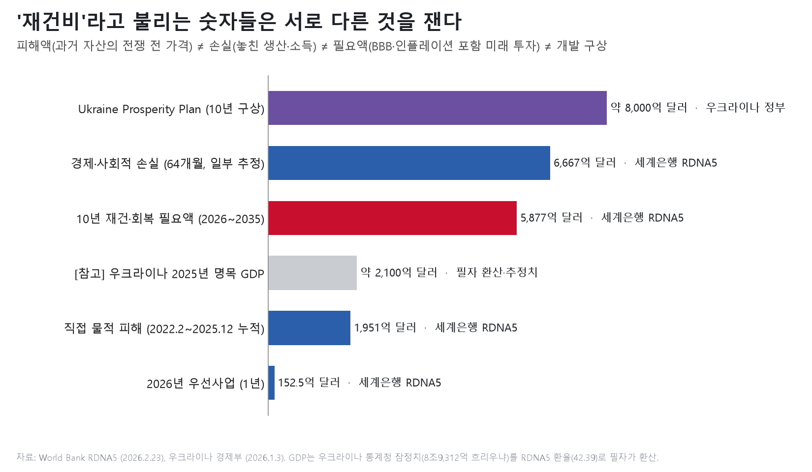
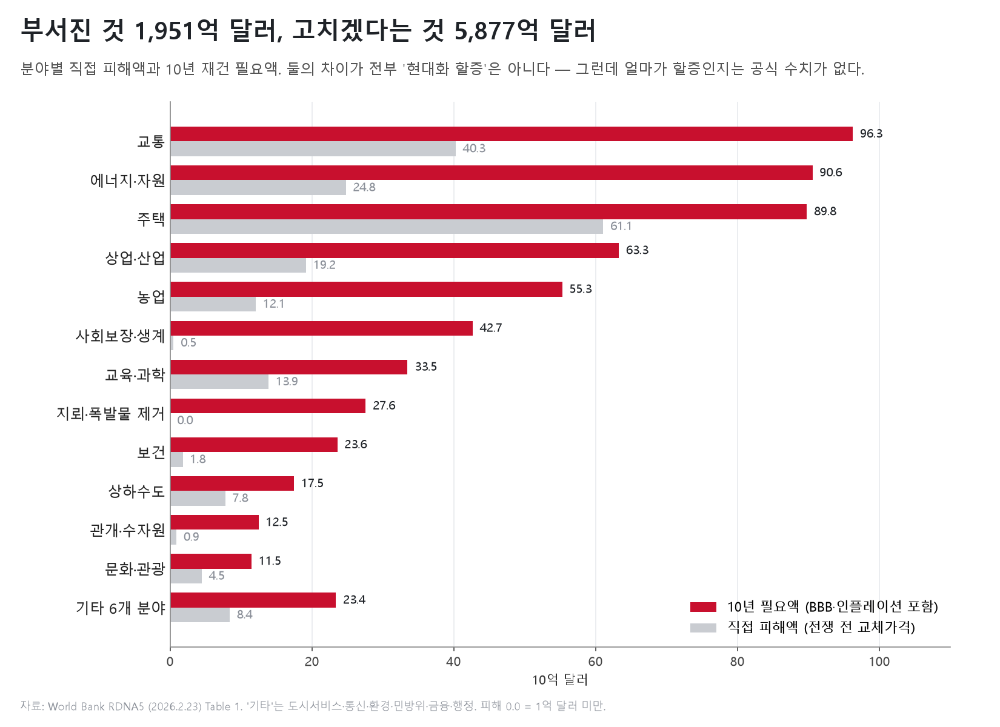
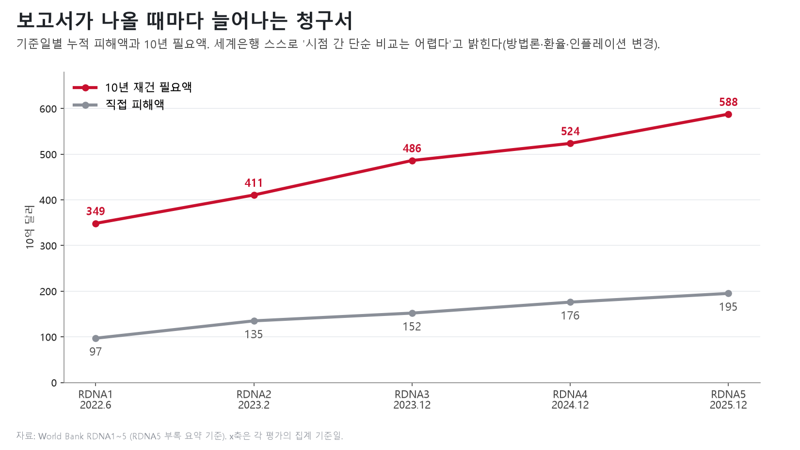
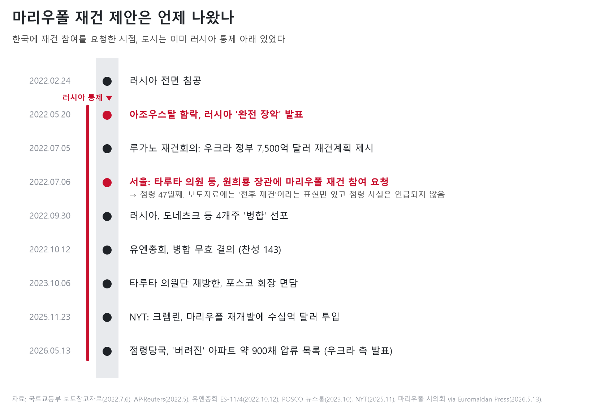
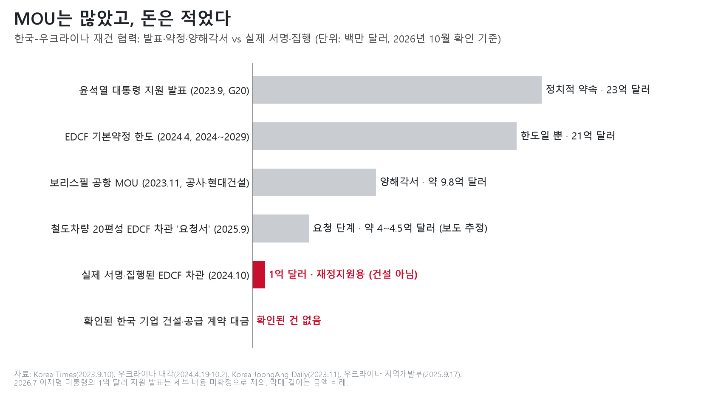
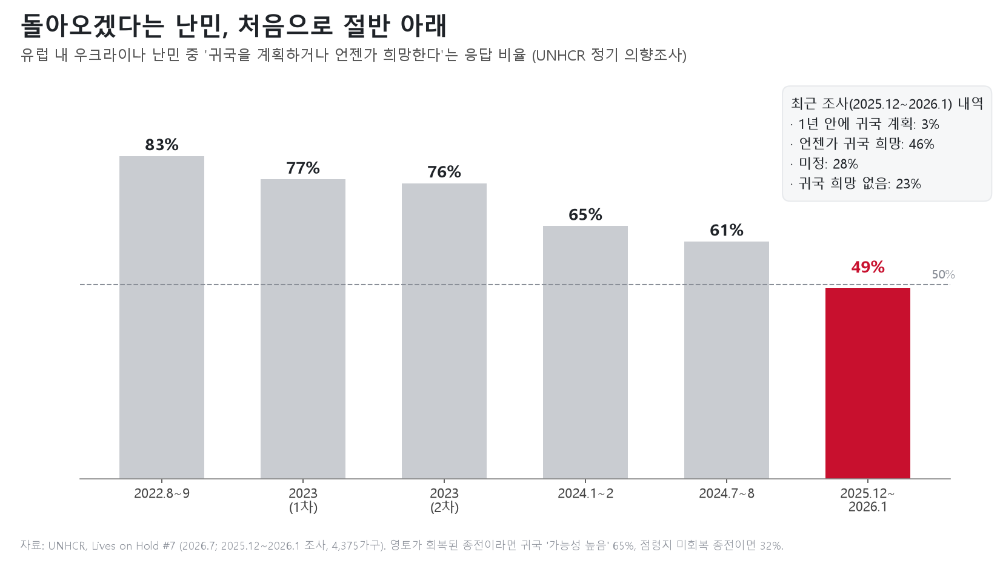

# 우크라이나 재건 - 21세기 최악의 사기극

> 부서진 것은 1,951억 달러어치다. 청구서에는 5,877억 달러가 적혀 있다. 그 사이의 4,000억 달러는 무엇인가.

---

## 1. 복구는 어떻게 '국가 개발계획'이 되었나

2026년 2월 23일, 세계은행은 우크라이나 정부·EU·유엔과 함께 다섯 번째 '신속 피해·수요 평가(RDNA5)'를 발표했다. 결론은 한 줄이다. 향후 10년간 재건·회복에 5,877억 달러가 필요하다. 보고서 스스로 "2025년 우크라이나 GDP의 거의 세 배"라고 썼다 [1][2].

그보다 한 달 반 앞선 1월 3일, 우크라이나 경제부는 'Ukraine Prosperity Plan'을 내놓았다. 10년간 약 8,000억 달러. 이름부터 '재건'이 아니라 '번영'이다. 경제부는 이를 우크라이나·미국·EU·G7이 함께하는 "전후 회복과 성장" 프로그램이라고 설명했다 [3].

이 숫자의 출발점은 2022년 7월 스위스 루가노다. 개전 넉 달 만에 우크라이나 정부는 7,500억 달러짜리 '국가 회복계획'을 들고 나왔다. 그 직후 서울에서는 우크라이나 의원들이 한국 국토교통부 장관에게 '마리우폴 재건'을 맡아 달라고 요청했다 [12].

그런데 RDNA5가 집계한 직접 물적 피해, 즉 실제로 부서진 건물·도로·발전소·공장의 가치는 1,951억 달러다. 피해액과 필요액 사이에는 약 4,000억 달러의 간극이 있다. 개발계획까지 놓고 보면 간극은 6,000억 달러가 넘는다.

먼저 분명히 해 둔다. 러시아의 침공은 불법이고, 우크라이나 시민이 입은 피해는 실재한다. 부서진 집과 발전소를 다시 세우는 일에 국제사회가 손을 보태는 것은 정당하다. 이 글이 묻는 것은 그다음이다. **그 청구서에 언제부터, 얼마만큼, 전쟁과 무관한 항목이 함께 실렸는가.**

---

## 2. 전쟁 전의 우크라이나: '파탄국가'는 아니었지만 '정체국가'였다

통계부터 보자. 세계은행 기준으로 2021년 우크라이나의 실질 GDP는 1990년의 62.9%였다. 전면전 직전까지 31년 동안 독립 당시의 경제 규모를 한 번도 회복하지 못했다는 뜻이다. 1990년대에만 경제의 59%가 사라졌다(1999년 바닥, 1990년 대비 40.8%). 2009년(-15.1%)과 2014~2015년(-10.1%, -9.8%)에 또 무너졌다. 같은 출발선에 섰던 폴란드는 같은 기간 3.1배가 됐다 [5].

2021년 1인당 GDP는 4,776달러로 폴란드(18,636달러)의 4분의 1, 몰도바(5,275달러)보다도 낮았다. 세계은행의 2021년 국가진단(SCD)은 이렇게 요약한다. 독립 당시 우크라이나의 1인당 실질소득은 폴란드보다 높았지만, 2020년에는 3분의 1 아래로 떨어졌다. 투자는 "사하라 이남 아프리카보다도 낮은" 수준이었다. 실제로 2021년 총고정자본형성은 GDP의 13.2%로, 유럽·중앙아시아 평균(24.7%)의 절반 남짓이었다 [4][5].

투자하지 않은 나라의 기반시설은 낡는다. 전쟁 전 우크라이나 정부 스스로 남긴 기록은 다음과 같다.

- 상수도망의 35%, 하수도망의 38%가 '비상 상태'였고, 수돗물의 36%가 공급 과정에서 새고 있었다. 2021년 4월 내각 명령에 적힌 수치다 [6].
- 2021년 6월 에너지부 장관은 화력발전 설비의 90%가 수명을 다했다고 말했다 [7].
- 2020년 철도공사 사장은 기관차의 약 95%가 사용연한을 넘겼다고 밝혔다 [8].
- 세계은행은 우크라이나 송전망을 유럽에서 가장 신뢰도가 낮은 축으로 평가했다. 송배전 손실은 OECD 평균의 2.5배였다 [4].

제도도 마찬가지였다. 2019년 중앙정부 소유 국유기업은 3,682개였고, 이들의 자산은 GDP의 40%를 넘었다. 세계은행은 그 "대다수가 휴면 상태이거나 적자"라고 진단했다. 같은 보고서는 "국가 포획, 만연한 부패, 널리 불신받는 사법"을 성장의 족쇄로 꼽았다. 2021년 국제투명성기구의 부패인식지수에서 우크라이나는 180개국 중 122위였다 [4][9].

그렇다고 '파탄국가'라는 딱지가 맞는 것은 아니다. 2014년 이후의 개혁은 실재했다.

- 약 90개 부실은행을 정리했고, 전자조달 시스템 Prozorro를 도입했다.
- 2015년 48.7%였던 물가상승률을 2020년 2.7%까지 끌어내렸다.
- 국영 에너지기업 Naftogaz의 준재정적자(GDP의 5.5%)를 흑자로 돌렸다.

2021년 '취약국가지수'에서 우크라이나는 179개국 중 91위로 '경고' 구간에 있었고, 러시아(74위)보다 덜 취약했다. 국가채무는 GDP의 48.9%, 신용등급은 B 수준이었다 [10][11].

따라서 정확한 진단은 이렇다. **기능이 붕괴한 국가는 아니었다. 다만 제도가 약하고, 국가가 이해집단에 포획됐고, 30년간 투자를 미뤄 온 저성장 국가였다.** 바로 이 점이 문제다. 전쟁이 터지기 전부터 쌓여 있던 숙제가, 지금 '전쟁 피해 복구'라는 같은 청구서에 실려 있기 때문이다.

---

## 3. 5,877억 달러의 해부

언론은 이 숫자들을 모두 '재건비'라고 부르지만, 각각이 재는 대상은 다르다.

| 숫자 | 무엇을 재나 | 기간·기준 | 작성 주체 |
|---|---|---|---|
| 직접 피해 1,951억 달러 | 파괴된 자산의 가치 (전쟁 전 교체가격) | 2022.2.24~2025.12.31, 46개월 | 세계은행 등 |
| 경제·사회 손실 6,667억 달러 | 놓친 생산·소득, 늘어난 비용 | 64개월 (18개월은 전망치) | 세계은행 등 |
| 재건·회복 필요액 5,877억 달러 | 앞으로 쓸 돈 (2025년 말 시장가격) | 2026~2035년, 10년 | 세계은행 등 |
| 2026년 우선사업 152.5억 달러 | 정부가 올해 집행하려는 사업 | 2026년 1년 | 우크라이나 정부 |
| Prosperity Plan 약 8,000억 달러 | 회복과 성장 투자 | 10년 | 우크라이나 정부 |

핵심은 세 번째 숫자의 정의에 있다. RDNA5는 '필요액'을 이렇게 정의한다. 수리·복원·재건 비용에 '더 낫게 다시 짓기(Build Back Better, BBB)' 할증을 반영한다. 할증의 예로는 에너지 효율 개선, 현대화, 지속가능성 기준을 든다. 여기에 인플레이션, 건설 물량 급증에 따른 단가 상승, 보험료 상승도 더한다. 그리고 보고서는 필요액이 피해와 손실의 합과 같지 않다고 명시한다 [2]. 주택 부문 필요액은 아예 "EU 법률과 유로코드(유럽 건축기준)에 맞춘 현대화"를 포함한다고 적혀 있다.

| 분야 | 직접 피해 | 10년 필요액 | 필요액 ÷ 피해 |
|---|---:|---:|---:|
| 교통 | 403억 | 963억 | 2.4배 |
| 에너지·자원 | 248억 | 906억 | 3.7배 |
| 주택 | 611억 | 898억 | 1.5배 |
| 상업·산업 | 192억 | 633억 | 3.3배 |
| 농업 | 121억 | 553억 | 4.6배 |
| 사회보장·생계 | 5억 | 427억 | — |
| 교육·과학 | 139억 | 335억 | 2.4배 |
| 지뢰·폭발물 제거 | 1억 미만 | 276억 | — |
| 보건 | 18억 | 236억 | 13배 |
| 상하수도 | 78억 | 175억 | 2.2배 |
| 기타 8개 분야 | 138억 | 474억 | 3.4배 |
| **합계** | **1,951억** | **5,877억** | **3.0배** |

(단위: 달러. 자료: RDNA5 Table 1 [2])

공정하게 말하자. 이 3배가 전부 '현대화 할증'은 아니다. 지뢰 제거(276억 달러)나 사회보장(427억 달러)은 부서진 자산이 아니라 전쟁이 낳은 손실에 대응하는 비용이다. 피해액이 0에 가까운 게 당연하고, 지원받을 이유도 충분하다.

문제는 나머지다. 이 글이 요구하는 구분은 세 가지다.

1. 전쟁으로 실제 파괴된 자산의 필수 복구
2. 전쟁 전부터 낡아 있던 시설의 교체·개량
3. EU 기준 도입이나 신산업 육성 같은 추가 현대화

RDNA5는 이 세 가지를 나누지 않는다. 보고서 전문에서 '할증(premium)'이라는 단어는 정의 문장에 단 한 번 나온다. 할증이 몇 퍼센트인지, 몇 달러인지는 어디에도 없다. BBB, 인플레이션, 물량 할증, 보험료가 하나의 숫자에 묶여 있을 뿐이다.

그래서 이 글도 임의로 숫자를 나누지 않겠다. 대신 의심할 근거만 제시한다.

- **상하수도.** 전쟁 전에 이미 상수도망의 35%가 비상 상태였다. 필요액은 피해의 2.2배다.
- **에너지.** 화력발전의 90%가 수명을 다한 상태였다. 필요액은 피해의 3.7배이고, 전력망 한 분야에만 708억 달러가 잡혀 있다. 그 방향은 원상복구가 아니라 분산형·재생에너지 중심의 새 전력체계다.
- **주택.** 독일 컨설팅사 Berlin Economics와 우크라이나 환경단체 Ecoaction이 키이우 인근 부차의 주택 복구비를 따져 본 사례가 있다. 전쟁 전 수준으로 복구하면 1.06억 유로다. 최소 효율기준을 맞추면 1.08억 유로, '준제로에너지' 수준까지 가면 2.12억 유로가 더 든다. 현대화가 복구비를 두세 배로 키운 것이다. 게다가 현행 에너지 요금에서는 투자비를 회수하는 데 27~34년이 걸린다 [34].

청구서는 해마다 커지기도 했다. RDNA1(2022년 6월 기준)의 3,490억 달러는 RDNA5에서 5,877억 달러가 됐다. 세계은행은 이 증가가 피해 누적뿐 아니라 "BBB 기준의 채택, 인플레이션, 부처별 상세 계획의 반영" 때문이라고 설명한다 [2].

공여국 납세자에게 필요한 것은 감성적 호소가 아니라 내역서다. **5,877억 달러 중 얼마가 '전쟁이 부순 것'이고, 얼마가 '원래 낡았던 것'이며, 얼마가 '이번 기회에 새로 갖추려는 것'인가.** 이 구분이 공식적으로 존재하지 않는다는 사실 자체가, 이 청구서가 회계 문서가 아니라 협상 문서라는 증거다.

---

## 4. 현대화 비용은 누구의 몫인가

반론도 들어 볼 만하다. 소련식 화력발전소와 단열 없는 아파트를 그대로 다시 짓는 것은 낭비다. 러시아 미사일은 대형 발전소를 노리고, 분산형 전력망은 더 버틴다. 국제에너지기구(IEA)도 분산형 전원이 "비용 효율적이고 회복력 있는 경로"라고 평가했다 [35]. EU 가입을 추진하는 나라가 EU 기준으로 짓는 것도 자연스럽다. 이 논리는 맞다. **복구하는 김에 현대화하는 것이 경제적이라는 데는 동의한다.**

그러나 '현대화하는 것이 합리적이다'와 '그 비용을 남이 내야 한다'는 다른 명제다. 지금 오가는 돈의 성격을 보자.

- **EU 우크라이나 기금(2024~2027년, 최대 500억 유로).** 핵심 축인 385억 유로 가운데 330억 유로가 대출이고, 무상은 55억 유로다. 투자 축(96억 유로)의 대부분은 보증이다 [23].
- **G7 ERA 대출(약 500억 달러).** 동결된 러시아 자산에서 나오는 초과수익으로 갚는 대출이다 [53].
- **EU 900억 유로 대출(2026~2027년).** 러시아 자산을 담보로 한 '배상대출'은 채택되지 못했고, EU가 시장에서 돈을 빌려 다시 빌려주는 방식이 됐다. 우크라이나는 러시아가 배상해야만 상환을 시작한다 [24][25]. 2026년 배정분 450억 유로 중 283억 유로는 국방비다 [26].
- **IMF 확대금융(81억 달러, 2026~2029년) [27].**
- **미·우크라이나 재건투자기금(종잣돈 1.5억 달러).** 첫 투자처는 군사용 드론의 무선조종 장비 업체였다 [29].

국제 공여국 플랫폼의 집계로는 '복구' 명목으로 약속된 돈이 약 640억 달러, 필요액의 11%에 불과하다. 플랫폼 스스로 비군사 지원이 갈수록 무상이 아닌 양허성 대출로 주어진다고 적었다 [30].

이제 상환능력을 보자.

- 우크라이나의 2025년 명목 GDP는 약 2,100억 달러(필자 환산)다.
- 공공부채는 2021년 GDP의 48.9%(IMF 일반정부 기준)에서 2025년 말 98.4%(재무부 잠정치, 국가·정부보증채무 기준)로 뛰었다 [11][33].
- 세계은행은 재정적자가 GDP의 약 25%로 "세계 최대"라고 썼다 [2].
- 2026~2029년 대외 재정조달 공백은 1,365억 달러다 [28].
- 2024년에는 유로본드 205억 달러에 명목 37%의 원금 삭감을 적용했다 [31]. 신용등급은 CCC+다 [32].

이런 나라에 현대화 비용을 '대출'로 얹으면 그것은 사실상 미래의 채무조정 대상이 된다. 결국 그 부담은 공여국 납세자에게 돌아온다. **대출이라는 이름을 단 무상원조**인 셈이다.

책임의 배분도 따져야 한다. 전쟁 피해는 가해자 러시아의 몫이고, 그 배상을 받아낼 때까지 국제사회가 다리를 놓는 것은 정당하다. 그러나 30년간 미룬 상수도 교체, 국유기업 정리, 요금 현실화는 우크라이나 정부가 져야 할 책임이다. 우크라이나 국민의 책임은 아니다. 그 정부가 전쟁 전에 하지 못한 숙제를, 전쟁을 계기로 외부 자금으로 한꺼번에 끝내려 한다면 그 대목만큼은 '피해 복구'라는 이름을 내려놓아야 한다.

---

## 5. 마리우폴과 한국: 점령된 도시의 재건 제안

2022년 7월 6일 국토교통부 보도참고자료의 제목은 「한-우크라, 전후 재건사업 협력 구체화」다. 부제는 "우크라측, 마리우폴市 등 재건사업에 한국기업 참여 요청"이었다 [12].

자료에 따르면 우크라이나 의회의 세르기 타루타·안드리 니콜라이옌코 의원과 드미트로 포노마렌코 주한대사가 원희룡 장관을 만났다. 마리우폴 출신 기업인이자 전 도네츠크 주지사인 타루타 의원은 "마리우폴 시내 주택 1만 2천 채가 전소되고 기반시설의 95%가 파괴"됐다고 설명했다. 그리고 한국의 전후 복구·신도시 경험을 바탕으로 정부와 기업이 마리우폴 재건을 새로운 표준으로 "담당해 줄 것"을 제안했다. 원 장관은 "마리우폴市 등 우크라이나 재건을 위해 적극 노력하겠다"고 답했고, 7월 중 민관 '재건협의체'를 꾸리겠다고 했다.

보도자료에 없는 사실이 하나 있다. 그날 마리우폴은 이미 러시아 손에 있었다. 아조우스탈 제철소의 마지막 수비대가 항복하고 러시아가 도시 '완전 장악'을 발표한 것은 5월 20일이다 [13]. 면담은 그로부터 47일째 되는 날이었다. 석 달 뒤 러시아는 도네츠크주 '병합'을 선포했다. 유엔총회는 143개국 찬성으로 이를 무효라고 결의했다 [14].

공정하게 짚어 둘 것도 있다. 제안의 표현은 '전후 재건'이었다. 당장 공사를 시작하자고 속인 것이 아니다. 무상원조를 명시적으로 요구한 것도 아니며, 한국 기업의 '참여'를 요청한 것이다. 또 이것은 의원단의 제안이었다. 우크라이나 정부가 루가노에서 국가별로 지역을 배정한 '후원 지도'에 한국과 마리우폴은 없었다. 그 지도 구상 자체도 덴마크-미콜라이우를 빼고는 사실상 흐지부지됐다 [50].

그래도 질문은 남는다. 영토 회복조차 불확실한 도시를 놓고 외국 장관과 '재건 협력 구체화'를 발표하는 것이 현실적이었는가. 마리우폴을 재건하려면 먼저 다음 문제가 풀려야 한다.

- 군사적 탈환이나 협상을 통한 반환
- 행정권과 치안의 회복
- 지뢰 제거
- 러시아가 재등록하고 압류한 부동산의 소유권 정리

그 사이 러시아는 마리우폴 재개발에 수십억 달러를 쏟아붓고 있다는 보도가 나왔다 [15]. 올해 5월에는 점령당국이 피란민이 떠난 아파트 약 900채를 '버려진 주택'으로 압류 목록에 올렸다는 우크라이나 측 발표가 있었다 [16]. 2022년 이후 한국 정부 문서 어디에도 마리우폴 사업은 다시 등장하지 않는다.

마리우폴만이 아니다. 한국의 우크라이나 재건 외교 전체가 비슷한 모양을 하고 있다.

- **2023년 9월.** 윤석열 대통령은 G20에서 23억 달러 지원을 발표했다. 2024년 3억 달러, 2025년부터 20억 달러의 대외경제협력기금(EDCF) 장기 저리 차관이다 [17].
- **2024년 4월.** 한도 21억 달러(2024~2029년)의 EDCF 기본약정이 체결됐다 [18]. 기본약정은 한도일 뿐이고, 사업마다 수출입은행과 별도 차관계약을 맺어야 한다.
- **2026년 10월 현재.** 확인되는 개별 차관계약은 2024년 10월의 1억 달러 하나다. 20년 만기에 금리 1%이고, 그마저 건설사업이 아니라 재정지원용이다 [19].
- **철도차량 20편성.** 우크라이나 내각이 2025년 9월 EDCF 차관 '요청서'를 승인한 단계다. 우크라이나 측은 공개입찰을 고수하고 있다 [20].
- **보리스필 공항.** 1.3조 원(약 9.8억 달러) 규모로 보도된 협약은 양해각서(MOU)다 [21].

우만 스마트시티와 키이우 교통 마스터플랜은 완료됐다. 다만 한국 정부 예산으로 수행한 용역이다. **2026년 10월까지 한국 기업이 대금을 받은 건설·공급 계약은 확인되지 않는다.**

EDCF는 무상원조(KOICA)가 아니라 갚아야 하는 유상원조다. 그러나 채무자는 2024년에 원금 37%를 삭감한 CCC+ 등급 국가다. 다자기구 MIGA는 2022년 이후 우크라이나 투자에 2.15억 달러 이상의 전쟁위험 보증을 섰다. 하지만 한국무역보험공사가 이런 전쟁위험 보증에 참여했다는 기록은 찾지 못했다. 대외경제정책연구원(KIEP)도 2024년 보고서에서 재원과 수익 정보가 없어 "섣불리 참여하기 어려움"이라고 진단했다. 그러면서 정부의 신중한 참여, 보험과 공여국 기업 컨소시엄을 통한 위험 분산을 권고했다 [22].

---

## 6. 누구를 위해, 몇 명을 위해 짓는가

재건의 경제성은 결국 사람 수로 결정된다.

- **인구.** 우크라이나 인구연구소는 2026년 7월 정부 통제 지역 인구를 약 2,900만 명으로 추정했다. 2022년 1월 공식 인구는 4,117만 명이었다(크림 제외). 집계 범위가 달라 단순 비교는 어렵지만, 비교 자체가 무의미할 만큼의 차이는 아니다 [39][52].
- **출생과 사망.** 2025년 출생은 16만 8,778명, 사망은 48만 5,296명이었다. 2026년 상반기에는 사망이 출생의 약 4배다 [40][54]. 합계출산율은 0.9 안팎이다 [55].
- **아동.** RDNA5는 아동 인구가 전쟁 전보다 33% 줄었다고 적었다 [2].
- **노동.** 2025년 취업자 1,070만 명에 연금 수급자가 1,020만 명이다. 일하는 사람 한 명이 연금 수급자 한 명을 떠받치는 구조다 [41].

난민은 전 세계 약 580만 명, EU 임시보호 대상만 443만 명이다 [36][37]. EU는 임시보호를 2028년 3월까지 연장했다 [38]. 유엔난민기구 조사에서 '귀국을 계획하거나 언젠가 희망한다'는 응답은 2022년 83%에서 2025년 말~2026년 초 49%로 떨어졌다. 1년 안에 돌아갈 계획이 있다는 사람은 3%뿐이다. 다만 영토가 온전히 회복된 채 전쟁이 끝난다면 65%가 귀국 가능성이 높다고 답했다. 점령지를 잃은 채 끝나면 그 비율은 32%로 떨어진다 [36].

이 대목에서 지리가 결정적이다.

- 피해의 75%가 최전선 주에 몰려 있다.
- 필요액의 19%가 도네츠크주, 6%가 루한스크주 몫이다.
- 그런데 2026년 초 기준으로 도네츠크주의 78%, 루한스크주의 99.6%가 점령돼 있다 [2][42].

필요액 5,877억 달러의 상당 부분은 지금 우크라이나가 손댈 수조차 없는 땅, 그리고 사람이 돌아오지 않을 수도 있는 땅에 배정돼 있다.

세계은행도 이 위험을 안다. RDNA5는 시범 재건사업의 교훈으로 이렇게 적었다. 투자 결정은 "현재와 예상 인구 패턴"에 따라야 하며, 그래야 과잉 또는 과소 투자를 피할 수 있다 [2]. 하버드의 글레이저 교수 등의 연구도 전쟁 전 정주 패턴을 복제하기보다 생산적인 지역에 투자를 모을 때 효과가 크다고 결론냈다 [43].

그러나 정작 5,877억 달러는 인구 시나리오별로 쪼개져 있지 않다. 재건 이후 시설을 유지하는 비용도 국가 차원에서 추산돼 있지 않다. 전쟁 전 수돗물의 36%가 새던 이유는 돈이 없어서만이 아니었다. 원가에 못 미치는 요금, 미뤄진 유지보수, 그리고 이를 바꾸지 못한 정치 때문이었다. 요금과 운영 구조를 그대로 둔 채 새 시설을 지으면, 그 시설은 다시 낡을 때까지 같은 길을 걷는다.

부패도 짚어야 한다.

- **'미다스' 사건.** 2025년 11월 반부패수사국(NABU)은 국영 원전기업 Energoatom 협력업체들로부터 10~15%의 리베이트를 걷어 약 1억 달러를 세탁한 혐의를 공개했다. 할루셴코 전 에너지·법무장관과 체르니쇼프 전 부총리 등 9명이 혐의를 통지받았다. 다만 2026년 10월 현재 유죄 판결은 없고, 피의자들은 혐의를 부인한다 [44].
- **반부패기관 독립성.** 2025년 7월 우크라이나 의회는 NABU와 반부패검찰의 독립성을 꺾는 법을 통과시켰다. 시민 시위가 일어난 뒤 9일 만에 되돌렸다 [45].
- **조건부 지원.** EU는 개혁 지연을 이유로 기금 분할금을 45억 유로에서 30.5억 유로로 깎았다 [47].

반대로 읽을 수도 있다. 부패가 드러나고 시민이 기관의 독립성을 지켜낸 것은 감시 체계가 작동한다는 증거다. 맞다. 그러나 그 감시 체계를 지켜낸 것은 시민이었다. 수천억 달러를 집행할 정부의 의지가 지켜낸 것이 아니었다.

---

## 7. 결론: 복구와 개발은 다른 계산서다

이 글이 '사기극'이라는 말을 쓰는 것은 누군가의 범죄를 고발하기 위해서가 아니다. 문제는 명분과 실체가 어긋나 있다는 데 있다. '전쟁 피해 복구'라는 반박하기 어려운 명분 아래, 30년 묵은 노후화 비용과 국가 현대화 구상, 그리고 개발계획이 하나의 숫자로 묶여 국제사회에 청구되고 있다. 청구하는 쪽도 그 내역을 나누지 않는다.

해법은 어렵지 않다.

1. **청구서를 세 장으로 나눈다.** 전쟁 피해 복구, 노후시설 교체, 추가 현대화다. 첫 번째는 러시아 배상과 국제 무상지원의 몫이다. 두 번째와 세 번째는 우크라이나 재정, 민간투자, 상환 가능한 차관의 몫이다.
2. **사업마다 인구 시나리오와 유지관리비를 공개한다.** 영토와 사람이 돌아오지 않을 수 있는 지역의 대규모 재건은 그 전제가 확인될 때까지 보류한다.
3. **요금 현실화, 국유기업 정리, 반부패기관의 독립을 지원의 선결조건으로 묶는다.**

한국에도 원칙이 필요하다.

- 양해각서가 아니라 재원이 확정된 계약만 '성과'로 발표한다.
- EDCF 차관은 상환 위험을 국회와 납세자에게 공개한다.
- MIGA 같은 다자 보증 없이 공적 자금을 전쟁위험에 노출하지 않는다.
- 점령지 사업은 영토 문제가 풀리기 전까지 협의 대상에서 뺀다.

우크라이나 국민이 다시 집과 일터를 갖도록 돕는 일은 국제사회의 의무에 가깝다. 그러나 한 국가의 30년 미래 개발계획을 외부 자금으로 완성해 주는 일은 의무가 아니다. 그것은 선택이고, 선택에는 가격표와 내역서가 따라야 한다.

**우크라이나를 재건하는 비용은 누가 부담해야 하는가. 그리고 국제사회는 어느 순간부터 전쟁 피해 복구가 아니라 한 국가의 미래 개발계획 전체를 지원하는 위치에 서게 되었는가?**

---

### 일러두기

- 제목의 '사기극'은 재건 청구서의 범위와 명분이 어긋난다는 필자의 논쟁적 평가다. 특정 개인이나 기관의 기망행위·불법행위를 사실로 주장하는 것이 아니다.
- 수사 중인 사건은 모두 혐의 단계이며, 유죄가 확정되지 않았다.
- 비판의 대상은 우크라이나 정부의 정책과 재건 구상이다. 우크라이나 국민이 아니다.
- 수치는 2026년 10월 9일까지 확인한 자료를 기준으로 했다. 항목별 검증 결과는 `sources_and_factcheck.md`, 미확인 주장은 `unverified_claims.md`에 정리했다.
- 도표는 모두 공개 통계로 필자가 직접 작성했다.

### 주요 출처 (번호는 본문 [n]과 대응)

1. 세계은행, Updated Ukraine Recovery and Reconstruction Needs Assessment Released (2026.2.23) https://www.worldbank.org/en/news/press-release/2026/02/23/updated-ukraine-recovery-and-reconstruction-needs-assessment-released
2. 세계은행·우크라이나 정부·EU·UN, Ukraine Fifth Rapid Damage and Needs Assessment (RDNA5) 보고서 (2026.2) https://documents1.worldbank.org/curated/en/099022026094036395/pdf/P514499-22f93f3a-4278-42bc-b907-db9553d12069.pdf
3. 우크라이나 경제·환경·농업부, Ukraine Prosperity Plan 발표 (2026.1.3) https://me.gov.ua/News/Detail/a39127c6-0df8-4880-b795-74150fd0c278?isSpecial=true&lang=uk-UA&title=UkraineProsperityPlan
4. 세계은행, Ukraine Systematic Country Diagnostic 2021 Update (2021.7~9 협의) https://www.worldbank.org/en/brief/2021/09/06/scd-consultations / 원문 https://thedocs.worldbank.org/en/doc/76b8952cdeee76b061cb9ced4baaee80-0080062021/original/Ukraine-SCD-2021-en.pdf
5. 세계은행 WDI (NY.GDP.MKTP.KD, NY.GDP.PCAP.CD, NE.GDI.FTOT.ZS; 2026.10.8 갱신분 조회) https://data.worldbank.org/country/ukraine
6. 우크라이나 내각 명령 No.388-р, '우크라이나 식수' 국가프로그램 개념 (2021.4.28) https://zakon.rada.gov.ua/laws/show/388-2021-р
7. ZN.ua, 할루셴코 에너지부 장관 "화력발전 설비 90% 수명 소진" (2021.6.18) https://zn.ua/ECONOMICS/v-ukraine-90-enerhoblokov-tes-otrabotali-svoj-resurs-halushchenko.html
8. GMK Center, 우크라이나 철도 기관차 노후화 (2020.10.2) https://gmk.center/?p=32065
9. TI Ukraine, Corruption Perceptions Index 2021 (2022.1) https://ti-ukraine.org/en/news/no-progress-ukraine-s-result-in-the-corruption-perceptions-index-2021/
10. Fund for Peace, Fragile States Index 2021 (2021.5) https://fragilestatesindex.org/
11. IMF World Economic Outlook DataMapper, 우크라이나 일반정부 부채 https://www.imf.org/external/datamapper/
12. 국토교통부 보도참고자료 「한-우크라, 전후 재건사업 협력 구체화」 (2022.7.6) https://www.molit.go.kr/USR/NEWS/m_72/dtl.jsp?id=95086933
13. AP, Russia claims to have taken full control of Mariupol (2022.5.20) https://triblive.com/news/world/russia-claims-to-have-taken-full-control-of-mariupol
14. Al Jazeera, UN condemns Russia's move to annex parts of Ukraine (2022.10.12) https://www.aljazeera.com/news/2022/10/12/un-condemns-russias-move-to-annex-parts-of-ukraine
15. New York Times 기사 재게재(San Juan Daily Star), Russian-occupied Mariupol (2025.11.24) https://www.sanjuandailystar.com/post/russian-occupied-mariupol-everything-ukrainian-must-go
16. Euromaidan Press, 마리우폴 아파트 900채 압류 (마리우폴 시의회 발표 인용, 2026.5.13) https://euromaidanpress.com/2026/05/13/russia-seizes-900-mariupol-apartments-from-owners-it-forced-to-flee/
17. Korea Times, Seoul pledges $2.3 bil. aid package to rebuild Ukraine (2023.9.10) https://www.koreatimes.co.kr/foreignaffairs/20230910/seoul-pledges-23-bil-aid-package-to-rebuild-ukraine
18. 우크라이나 내각, 한국과 최대 21억 달러 EDCF 기본약정 서명 (2024.4.19) https://www.kmu.gov.ua/en/news/ukraina-otrymaie-mozhlyvist-zaluchaty-kredytni-resursy-zahalnym-obsiahom-do-21-mlrd-vid-pivdennoi-korei-uriady-krain-pidpysaly-vidpovidnu-uhodu
19. 우크라이나 내각, 한국 수출입은행과 1억 달러 차관계약 서명 (2024.10.2) https://www.kmu.gov.ua/en/news/ukraina-vpershe-otrymaie-pilhove-finansuvannia-vid-respubliky-koreia-serhii-marchenko-pidpysav-kredytnyi-dohovir-na-100-mln-dolariv-ssha
20. 우크라이나 지역개발부, 쿨레바 부총리 방한·철도차량 협력 (2025.9.17) https://mindev.gov.ua/en/news/spivpratsia-z-koreiskymy-kompaniiamy-posylyt-stiikist-ukrainskoi-zaliznytsi-oleksii-kuleba
21. Korea JoongAng Daily, KAC·현대건설 보리스필 공항 MOU (2023.11) https://www.koreajoongangdaily.com/business/kac-hyundai-ec-ink-983m-deal-to-revamp-kyiv-intl-airport/11017714
22. 대외경제정책연구원, 「전후 우크라이나 재건 사업의 국제 논의와 한국기업 참여 가능성 연구」 (2024.11.13) https://eiec.kdi.re.kr/policy/domesticView.do?ac=0000189716
23. 유럽연합 집행위원회, Ukraine Facility (2026 조회) https://enlargement.ec.europa.eu/funding-technical-assistance/ukraine-facility_en
24. EEAS, European Council 18 December 2025 – Ukraine (2025.12.18) https://www.eeas.europa.eu/delegations/ukraine/european-council-18-december-2025-ukraine_en
25. 우크라이나 재무부, EU 900억 유로 지원 결정 환영 (2025.12.19) https://www.kmu.gov.ua/en/news/minfin-vitaie-rishennia-rady-ies-shchodo-namiru-nadaty-ukraini-90-mlrd-ievro-finansovoi-dopomohy-na-2026-2027-roky
26. 유럽연합 집행위원회 DG DEFIS, EUR 1.24 billion disbursement (2026.10.8) https://defence-industry-space.ec.europa.eu/commission-disburses-eur124-billion-ukraine-drones-and-missiles-2026-10-08_en
27. IMF PR 26/066, USD 8.1 billion EFF 승인 (2026.2.26) https://www.imf.org/en/news/articles/2026/02/26/pr-26066-ukraine-imf-executive-board-approves-usd-8point1-billion-under-an-eff-arrangement
28. 우크라이나 재무부, IMF 신규 프로그램 승인 (2026.2.27) https://www.kmu.gov.ua/en/news/minfin-rada-vykonavchykh-dyrektoriv-mvf-skhvalyla-novu-prohramu-rozshyrenoho-finansuvannia-dlia-ukrainy-u-rozmiri-81-mlrd
29. 미 재무부, 미·우크라이나 재건투자기금 첫 투자 (2026.3) https://home.treasury.gov/news/press-releases/sb0424
30. Ukraine Donor Platform 뉴스레터 (2026.7) https://ukrainedonorplatform.com/?p=20326
31. 우크라이나 내각, 205억 달러 유로본드 구조조정 완료 (2024.9) https://www.kmu.gov.ua/en/news/ukraina-zavershyla-restrukturyzatsiiu-derzhavnykh-oblihatsii-ta-harantovanykh-derzhavoiu-ievrooblihatsii-na-sumu-205-mlrd-dolariv-ssha
32. Liga.net, S&P upgrades Ukraine to CCC+ (2026.1) https://finance.liga.net/en/ekonomika/novosti/sp-upgrades-ukraines-credit-rating-to-ccc-after-debt-restructuring
33. 우크라이나 재무부, 2025년 국가채무 관리 결과 보고서 (2026) https://mof.gov.ua/storage/files/ENG_Report_on_State_Debt_and_State-Guaranteed_Debt_Management_Results_for_2025.pdf
34. Berlin Economics·Ecoaction, The Green Reconstruction of the Residential Sector (2024.3) https://en.ecoaction.org.ua/wp-content/uploads/2024/03/Executive_Summary_The_Green_Reconstruction_of_the_Residential_Sector.pdf
35. IEA, Empowering Ukraine Through a Decentralised Electricity System (2024) https://www.iea.org/reports/empowering-ukraine-through-a-decentralised-electricity-system
36. UNHCR, Lives on Hold #7 (2026.7) https://data.unhcr.org/en/documents/download/123284
37. Eunews, Eurostat: 4.43 million Ukrainians under temporary protection (2026.9.10) https://www.eunews.it/en/2026/09/10/eurostat-4-43-million-ukrainians-under-temporary-protection-in-the-eu-in-july-2026/
38. EEAS, 임시보호 2028년 3월까지 연장 (2026.7) https://www.eeas.europa.eu/delegations/ukraine/eu-countries-agree-extend-temporary-protection-those-fleeing-ukraine-until-march-2028_en
39. Interfax-Ukraine, 리바노바 "정부 통제지역 인구 약 2,900만" (2026.7.20) https://en.interfax.com.ua/news/general/1186657.html
40. Opendatabot, 2025년 출생·사망 (2026.1) https://opendatabot.ua/en/analytics/birth-death-2025-12
41. KSE Institute, Human Capital Chartbook (2026.3.10) https://kse.ua/about-the-school/news/human-capital-trends-in-ukraine-make-reforms-of-the-labour-market-social-benefits-system-and-education-funding-key-priorities-for-2026-human-capital-chartbook-kse-institute/
42. online.ua, DeepState 2026.1.1 기준 점령 면적 (2026.1.6) https://news.online.ua/en/deepstate-calculated-the-area-of-ukraine-occupied-by-the-russian-federation-in-2025-900209/
43. Glaeser·Kirchberger·Parkhomenko, Rebuilding Ukraine's Cities, NBER WP 34598 (2025.12) https://www.nber.org/papers/w34598
44. Euromaidan Press, 할루셴코 전 장관 기소 (2026.2.16) https://euromaidanpress.com/2026/02/16/ukraine-ex-energy-minister-halushchenko-charged-midas/
45. Ukranews, NABU·SAP 독립성 복원법 서명 (2025.7.31) https://ukranews.com/en/news/1097057-zelenskyy-signs-law-on-restoring-independence-of-nabu-and-sapo
46. TI Ukraine, Corruption Perceptions Index 2025 (2026.2.10) https://ti-ukraine.org/en/research/corruption-perceptions-index-2025/
47. Kyiv Independent, EU cuts next Ukraine Facility tranche (2025.7) https://kyivindependent.com/eu-cuts-next-ukraine-facility-aid-tranche-over-delayed-reforms/
48. Kyiv Independent, What we know about Ukraine's $800 billion economic peace plan (2026.1.8) https://kyivindependent.com/what-we-know-about-ukraines-800-billion-economic-peace-plan/
49. European Pravda, Prosperity Plan 초안 보도 (2026.1.23) https://www.pravda.com.ua/eng/news/2026/01/23/8017583/
50. Kyiv Post, 지역 후원(patronage) 구상의 폐기 (2024.3.24) https://www.kyivpost.com/post/29917
51. Centre for Economic Strategy, 난민 5차 조사 (2026.2.26) https://ces.org.ua/en/ukrainian-refugees-fifth-wave/
52. 우크라이나 국가통계청, 2022.1.1 현재인구 https://lv.ukrstat.gov.ua/ukr/help/pb_fig2021/en/chapter_2_1.html
53. 유럽연합 집행위원회 DG ECFIN, G7 ERA 대출 개요 https://economy-finance.ec.europa.eu/international-economic-relations/candidate-and-neighbouring-countries/ukraine_en
54. Zmina, 2026년 상반기 사망이 출생의 4배 (2026.7) https://zmina.info/en/news-en/ukraines-mortality-rate-exceeds-birth-rate-fourfold/
55. NV, 우크라이나 출산율 사상 최저 (사회정책부 차관 발언, 2025.3) https://english.nv.ua/nation/ukraine-s-birth-rate-hits-record-low-50494770.html
